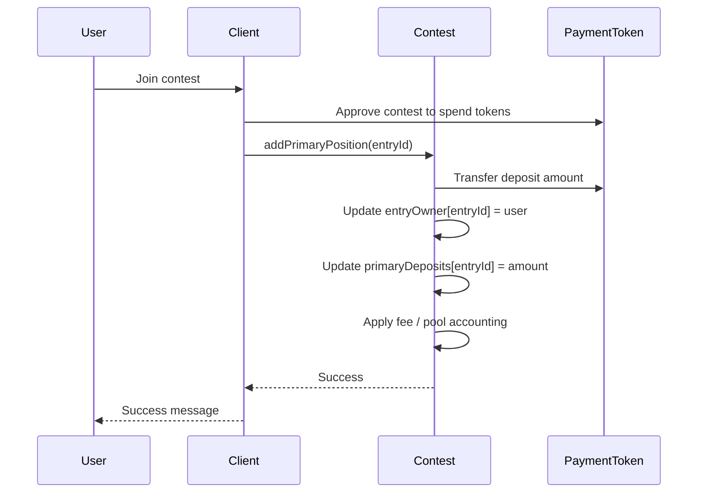
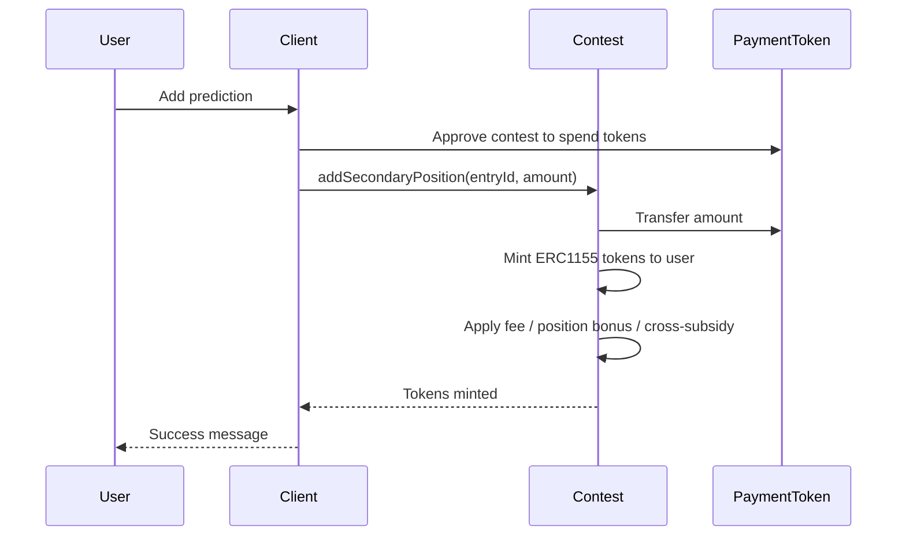
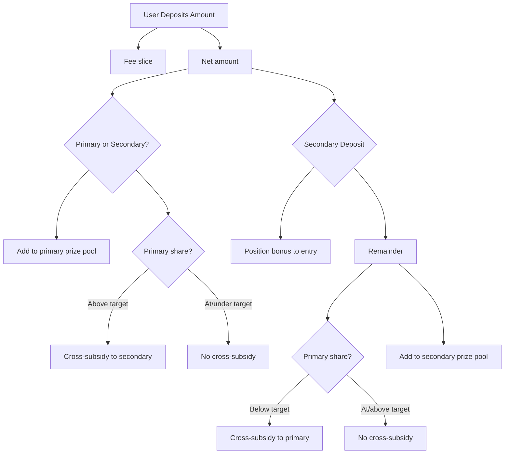
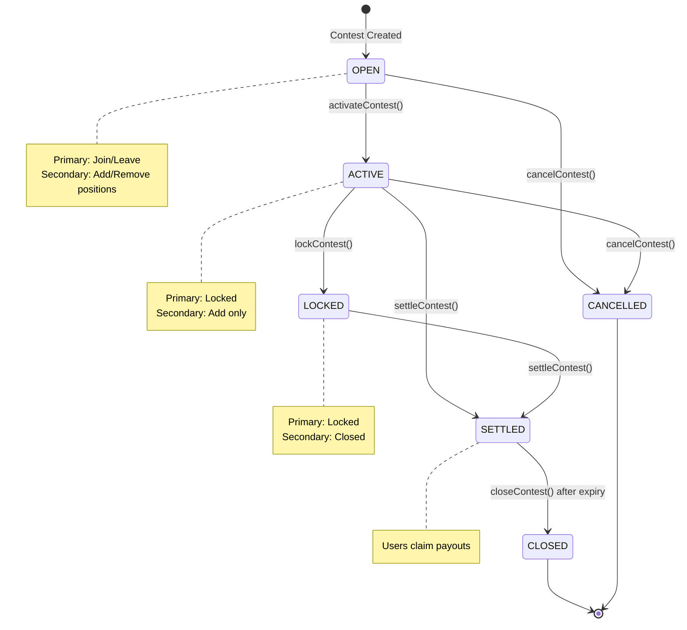

# Contracts Data Flow

## Primary Participant Flow


```mermaid
sequenceDiagram
    participant User
    participant Client
    participant Contest
    participant PaymentToken

    User->>Client: Join contest
    Client->>PaymentToken: Approve contest to spend tokens
    Client->>Contest: addPrimaryPosition(entryId)
    Contest->>PaymentToken: Transfer deposit amount
    Contest->>Contest: Update entryOwner[entryId] = user
    Contest->>Contest: Update primaryDeposits[entryId] = amount
    Contest->>Contest: Apply fee / pool accounting
    Contest-->>Client: Success
    Client-->>User: Success message
```

## Secondary Participant Flow


```mermaid
sequenceDiagram
    participant User
    participant Client
    participant Contest
    participant PaymentToken

    User->>Client: Add prediction
    Client->>PaymentToken: Approve contest to spend tokens
    Client->>Contest: addSecondaryPosition(entryId, amount)
    Contest->>PaymentToken: Transfer amount
    Contest->>Contest: Mint ERC1155 tokens to user
    Contest->>Contest: Apply fee / position bonus / cross-subsidy
    Contest-->>Client: Tokens minted
    Client-->>User: Success message
```

## Contest Settlement Flow

```mermaid
sequenceDiagram
    participant Oracle
    participant Server
    participant Contest
    participant PaymentToken
    participant PrimaryWinner
    participant SecondaryWinner

    Oracle->>Server: Trigger settlement
    Server->>Contest: settleContest(winningEntries, payouts, referralReward, signature)
    Note over Server,Contest: Referral fee at settlement; REFERRAL rows from settlement receipt
    Contest->>Contest: Calculate primary payouts
    Contest->>Contest: Set secondary winner
    Contest->>Contest: Update state to SETTLED
    Contest-->>Server: Settlement complete

    PrimaryWinner->>Contest: claimPrimaryPayout(entryId)
    Contest->>PaymentToken: Transfer to winner
    Contest-->>PrimaryWinner: Payout received

    SecondaryWinner->>Contest: claimSecondaryPayout(entryId)
    Contest->>PaymentToken: Transfer to winner
    Contest-->>SecondaryWinner: Payout received
```

Payment token is canonical **USDC** on Base mainnet and **MockUSDC (xUSDC)** on Sepolia.

## Economic Flow (Deposit Processing)


```mermaid
flowchart TD
    Deposit[User Deposits Amount]
    Deposit --> OracleFee[Fee slice]
    Deposit --> NetAmount[Net amount]

    NetAmount --> Primary{Primary or Secondary?}

    Primary --> PrimaryPool[Add to primary prize pool]
    Primary --> CheckRatio{Primary share?}
    CheckRatio -->|Above target| CrossSubsidy1[Cross-subsidy to secondary]
    CheckRatio -->|At/under target| NoSubsidy1[No cross-subsidy]

    NetAmount --> Secondary{Secondary Deposit}
    Secondary --> PositionBonus[Position bonus to entry]
    Secondary --> Remaining[Remainder]
    Remaining --> CheckRatio2{Primary share?}
    CheckRatio2 -->|Below target| CrossSubsidy2[Cross-subsidy to primary]
    CheckRatio2 -->|At/above target| NoSubsidy2[No cross-subsidy]
    Remaining --> SecondaryPool[Add to secondary prize pool]
```

## State Transition Flow


```mermaid
stateDiagram-v2
    [*] --> OPEN: Contest Created

    OPEN --> ACTIVE: activateContest()
    OPEN --> CANCELLED: cancelContest()

    ACTIVE --> LOCKED: lockContest()
    ACTIVE --> SETTLED: settleContest()
    ACTIVE --> CANCELLED: cancelContest()

    LOCKED --> SETTLED: settleContest()

    SETTLED --> CLOSED: closeContest() after expiry

    CLOSED --> [*]
    CANCELLED --> [*]

    note right of OPEN
        Primary: Join/Leave
        Secondary: Add/Remove positions
    end note

    note right of ACTIVE
        Primary: Locked
        Secondary: Add only
    end note

    note right of LOCKED
        Primary: Locked
        Secondary: Closed
    end note

    note right of SETTLED
        Users claim payouts
    end note
```

## Key Data Transformations

### Primary Deposit
```
Input: amount (payment token)
├─ Fee slices per contest settings
└─ Net → primary prize pool (+ optional cross-subsidy)
```

### Secondary Deposit
```
Input: amount (payment token), entryId
├─ Fee slices per contest settings
├─ Position bonus → entry owner allocation
└─ Remainder → secondary prize pool (+ optional cross-subsidy)
```

### Settlement Calculation
```
Primary Payout:
├─ Layer1Pool = primary prize + subsidy
├─ For each winner: payout = Layer1Pool × payoutBps[i] / 10000
└─ Position bonus if allocated

Secondary Payout:
├─ Winner entry liquidity share
└─ Pro-rata of secondary prize pool
```
