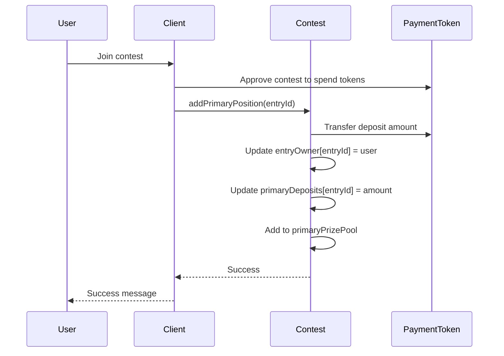
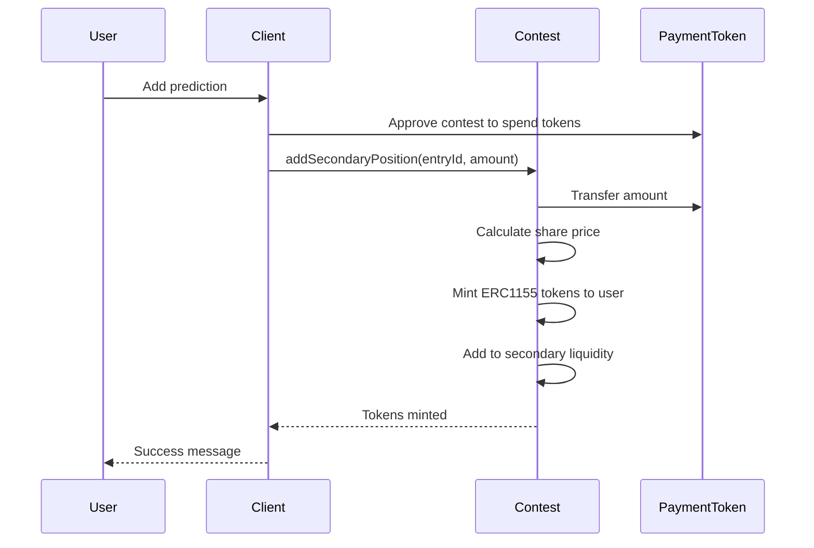
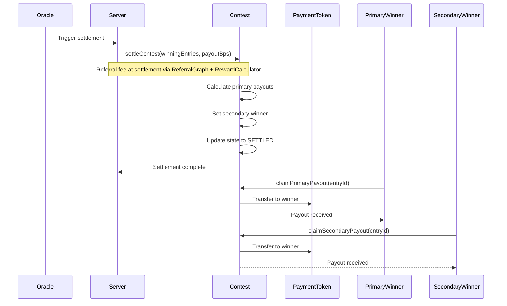
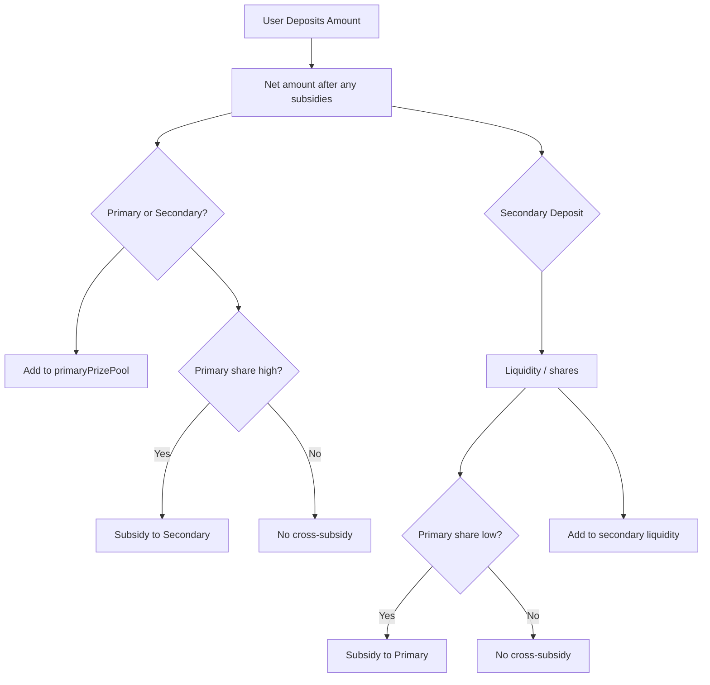
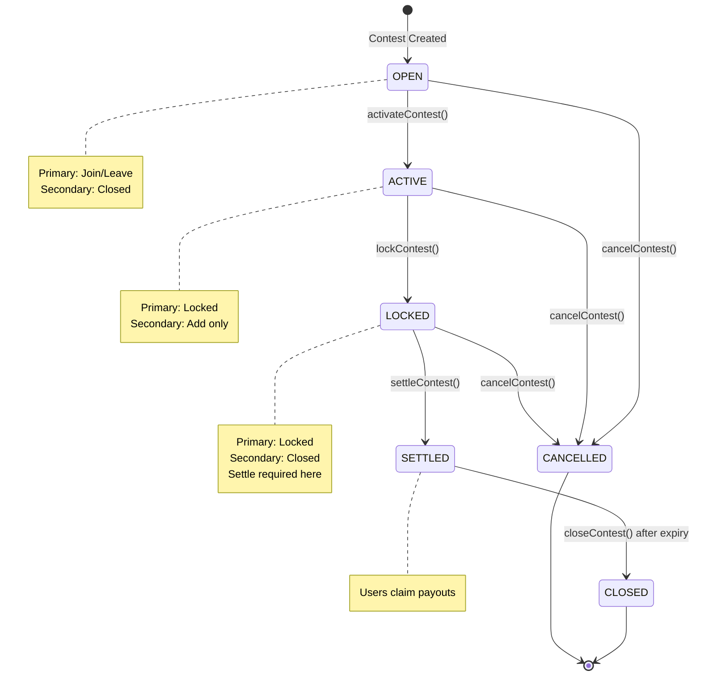

# Contracts Data Flow

## Primary Participant Flow


```mermaid
sequenceDiagram
    participant User
    participant Client
    participant Contest
    participant PaymentToken
    
    User->>Client: Join contest
    Client->>PaymentToken: Approve contest to spend tokens
    Client->>Contest: addPrimaryPosition(entryId)
    Contest->>PaymentToken: Transfer deposit amount
    Contest->>Contest: Update entryOwner[entryId] = user
    Contest->>Contest: Update primaryDeposits[entryId] = amount
    Contest->>Contest: Add to primaryPrizePool
    Contest-->>Client: Success
    Client-->>User: Success message
```

## Secondary Participant Flow


```mermaid
sequenceDiagram
    participant User
    participant Client
    participant Contest
    participant PaymentToken
    
    User->>Client: Add prediction
    Client->>PaymentToken: Approve contest to spend tokens
    Client->>Contest: addSecondaryPosition(entryId, amount)
    Contest->>PaymentToken: Transfer amount
    Contest->>Contest: Calculate share price
    Contest->>Contest: Mint ERC1155 tokens to user
    Contest->>Contest: Add to secondary liquidity
    Contest-->>Client: Tokens minted
    Client-->>User: Success message
```

## Contest Settlement Flow


```mermaid
sequenceDiagram
    participant Oracle
    participant Server
    participant Contest
    participant PaymentToken
    participant PrimaryWinner
    participant SecondaryWinner
    
    Oracle->>Server: Trigger settlement
    Server->>Contest: settleContest(winningEntries, payoutBps)
    Note over Server,Contest: Referral fee at settlement via ReferralGraph + RewardCalculator
    Contest->>Contest: Calculate primary payouts
    Contest->>Contest: Set secondary winner
    Contest->>Contest: Update state to SETTLED
    Contest-->>Server: Settlement complete
    
    PrimaryWinner->>Contest: claimPrimaryPayout(entryId)
    Contest->>PaymentToken: Transfer to winner
    Contest-->>PrimaryWinner: Payout received
    
    SecondaryWinner->>Contest: claimSecondaryPayout(entryId)
    Contest->>PaymentToken: Transfer to winner
    Contest-->>SecondaryWinner: Payout received
```

## Economic Flow (Deposit Processing)


```mermaid
flowchart TD
    Deposit[User Deposits Amount]
    Deposit --> NetAmount[Net amount after any subsidies]
    
    NetAmount --> Primary{Primary or Secondary?}
    
    Primary --> PrimaryPool[Add to primaryPrizePool]
    Primary --> CheckRatio{Primary share high?}
    CheckRatio -->|Yes| CrossSubsidy1[Subsidy to Secondary]
    CheckRatio -->|No| NoSubsidy1[No cross-subsidy]
    
    NetAmount --> Secondary{Secondary Deposit}
    Secondary --> Remaining[Liquidity / shares]
    Remaining --> CheckRatio2{Primary share low?}
    CheckRatio2 -->|Yes| CrossSubsidy2[Subsidy to Primary]
    CheckRatio2 -->|No| NoSubsidy2[No cross-subsidy]
    Remaining --> SecondaryPool[Add to secondary liquidity]
```

## State Transition Flow


```mermaid
stateDiagram-v2
    [*] --> OPEN: Contest Created
    
    OPEN --> ACTIVE: activateContest()
    OPEN --> CANCELLED: cancelContest()
    
    ACTIVE --> LOCKED: lockContest()
    ACTIVE --> CANCELLED: cancelContest()
    
    LOCKED --> SETTLED: settleContest()
    LOCKED --> CANCELLED: cancelContest()
    
    SETTLED --> CLOSED: closeContest() after expiry
    
    CLOSED --> [*]
    CANCELLED --> [*]
    
    note right of OPEN
        Primary: Join/Leave
        Secondary: Closed
    end note
    
    note right of ACTIVE
        Primary: Locked
        Secondary: Add only
    end note
    
    note right of LOCKED
        Primary: Locked
        Secondary: Closed
        Settle required here
    end note
    
    note right of SETTLED
        Users claim payouts
    end note
```

## Key Data Transformations

### Primary Deposit
```
Input: amount (payment token)
└─ Split via primaryDepositSecondarySubsidyBps
   ├─ Subsidy → secondaryPrimarySubsidyPerEntry[entryId]
   └─ Remainder → primaryPrizePool
```

### Secondary Deposit
```
Input: amount (payment token), entryId
├─ Normalize amount via toShareUnits(paymentTokenDecimals)
├─ Mint ERC1155 shares via bonding curve
└─ Add amount → secondaryLiquidityPerEntry[entryId]
```

### Settlement Calculation
```
Gross TVL → deduct referralNetworkBps fee (ReferralGraph + RewardCalculator)
Primary Payout:
├─ Remaining primary pool × payoutBps[i] / 10000 per winning entry
└─ Secondary TVL aggregated onto winning entry when it has ERC1155 supply

Secondary Payout:
├─ Winner-take-all pro-rata on secondaryWinningEntry liquidity share
└─ Dust remains for closeContest sweep
```
