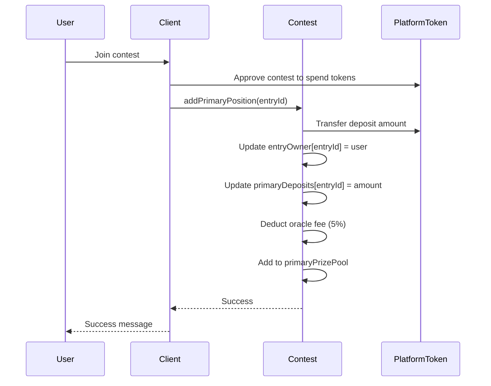
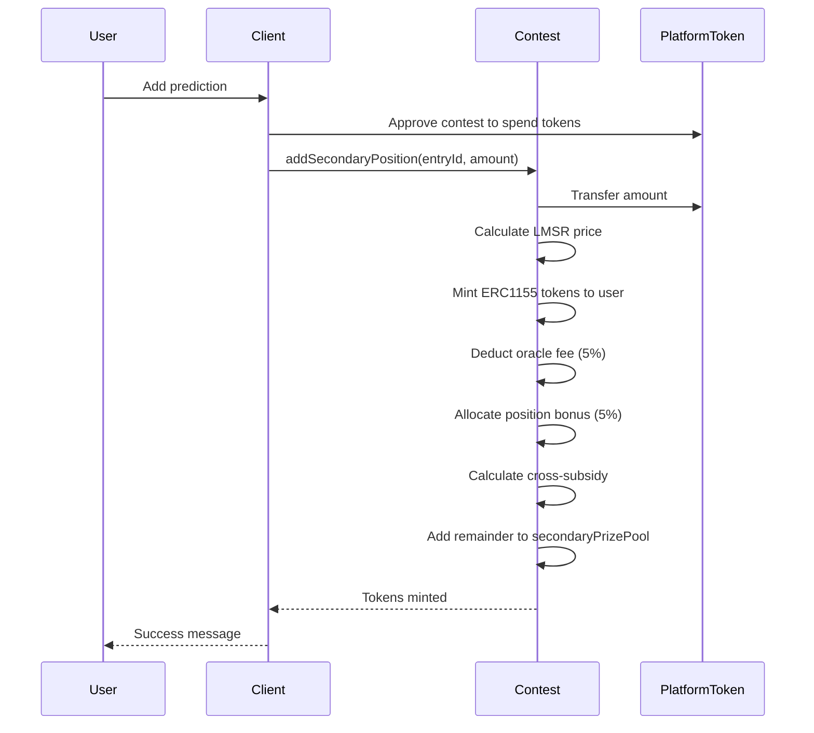
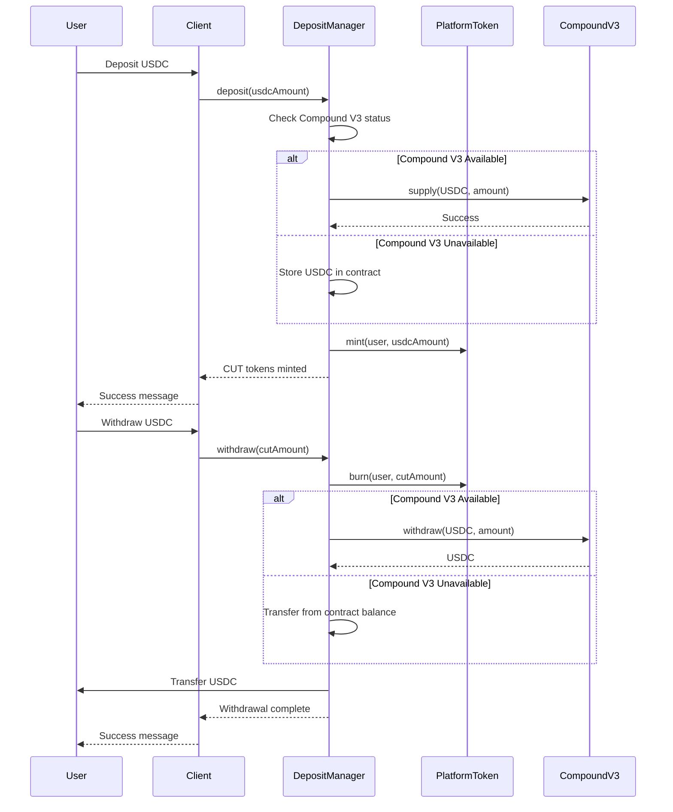
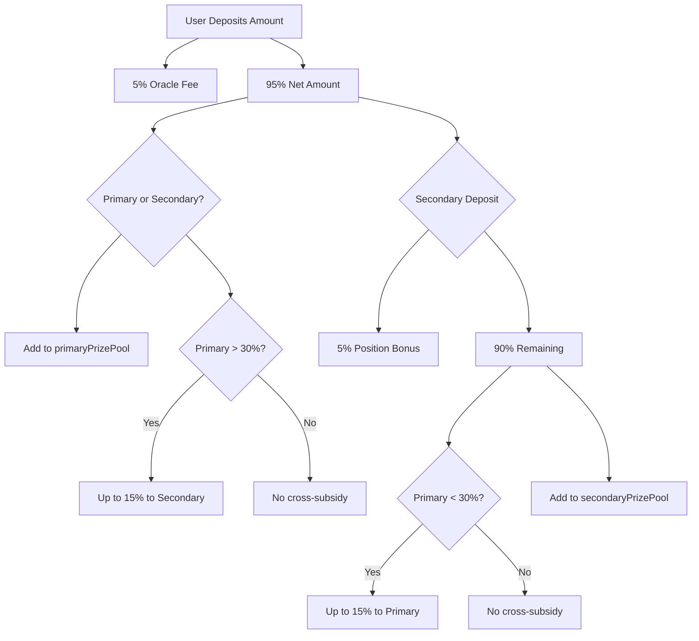
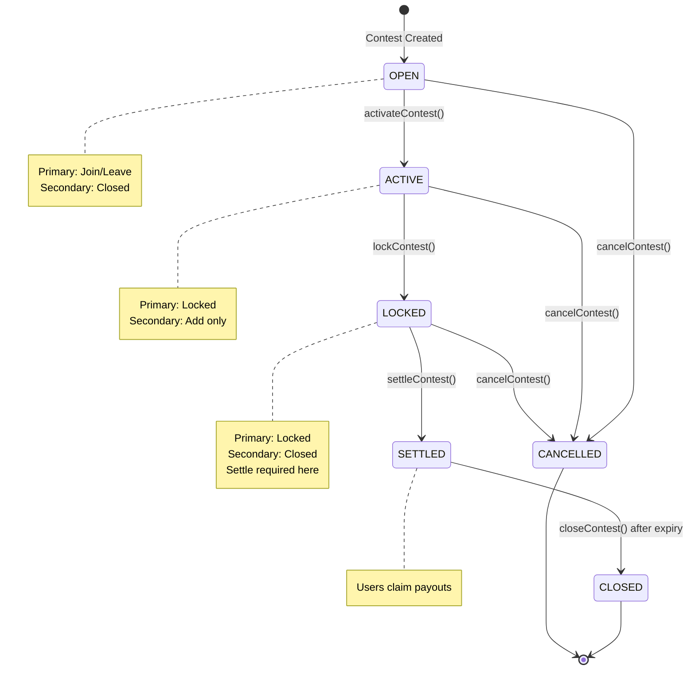

# Contracts Data Flow

## Primary Participant Flow


```mermaid
sequenceDiagram
    participant User
    participant Client
    participant Contest
    participant PlatformToken
    
    User->>Client: Join contest
    Client->>PlatformToken: Approve contest to spend tokens
    Client->>Contest: addPrimaryPosition(entryId)
    Contest->>PlatformToken: Transfer deposit amount
    Contest->>Contest: Update entryOwner[entryId] = user
    Contest->>Contest: Update primaryDeposits[entryId] = amount
    Contest->>Contest: Deduct oracle fee (5%)
    Contest->>Contest: Add to primaryPrizePool
    Contest-->>Client: Success
    Client-->>User: Success message
```

## Secondary Participant Flow


```mermaid
sequenceDiagram
    participant User
    participant Client
    participant Contest
    participant PlatformToken
    
    User->>Client: Add prediction
    Client->>PlatformToken: Approve contest to spend tokens
    Client->>Contest: addSecondaryPosition(entryId, amount)
    Contest->>PlatformToken: Transfer amount
    Contest->>Contest: Calculate LMSR price
    Contest->>Contest: Mint ERC1155 tokens to user
    Contest->>Contest: Deduct oracle fee (5%)
    Contest->>Contest: Allocate position bonus (5%)
    Contest->>Contest: Calculate cross-subsidy
    Contest->>Contest: Add remainder to secondaryPrizePool
    Contest-->>Client: Tokens minted
    Client-->>User: Success message
```

## Contest Settlement Flow

```mermaid
sequenceDiagram
    participant Oracle
    participant Server
    participant Contest
    participant PrimaryWinner
    participant SecondaryWinner
    
    Oracle->>Server: Trigger settlement
    Server->>Contest: settleContest(winningEntries, payouts)
    Note over Server,Contest: Referral fee at settlement; REFERRAL rows from settlement receipt
    Contest->>Contest: Calculate primary payouts
    Contest->>Contest: Set secondary winner (first entry)
    Contest->>Contest: Update state to SETTLED
    Contest-->>Server: Settlement complete
    
    PrimaryWinner->>Contest: claimPrimaryPayout(entryId)
    Contest->>Contest: Calculate prize + position bonus
    Contest->>PlatformToken: Transfer to winner
    Contest-->>PrimaryWinner: Payout received
    
    SecondaryWinner->>Contest: claimSecondaryPayout(entryId)
    Contest->>Contest: Calculate share of secondaryPrizePool
    Contest->>PlatformToken: Transfer to winner
    Contest-->>SecondaryWinner: Payout received
```

## Deposit/Withdrawal Flow


```mermaid
sequenceDiagram
    participant User
    participant Client
    participant DepositManager
    participant PlatformToken
    participant CompoundV3
    
    User->>Client: Deposit USDC
    Client->>DepositManager: deposit(usdcAmount)
    DepositManager->>DepositManager: Check Compound V3 status
    alt Compound V3 Available
        DepositManager->>CompoundV3: supply(USDC, amount)
        CompoundV3-->>DepositManager: Success
    else Compound V3 Unavailable
        DepositManager->>DepositManager: Store USDC in contract
    end
    DepositManager->>PlatformToken: mint(user, usdcAmount)
    DepositManager-->>Client: CUT tokens minted
    Client-->>User: Success message
    
    User->>Client: Withdraw USDC
    Client->>DepositManager: withdraw(cutAmount)
    DepositManager->>PlatformToken: burn(user, cutAmount)
    alt Compound V3 Available
        DepositManager->>CompoundV3: withdraw(USDC, amount)
        CompoundV3-->>DepositManager: USDC
    else Compound V3 Unavailable
        DepositManager->>DepositManager: Transfer from contract balance
    end
    DepositManager->>User: Transfer USDC
    DepositManager-->>Client: Withdrawal complete
    Client-->>User: Success message
```

## Economic Flow (Deposit Processing)


```mermaid
flowchart TD
    Deposit[User Deposits Amount]
    Deposit --> OracleFee[5% Oracle Fee]
    Deposit --> NetAmount[95% Net Amount]
    
    NetAmount --> Primary{Primary or Secondary?}
    
    Primary --> PrimaryPool[Add to primaryPrizePool]
    Primary --> CheckRatio{Primary > 30%?}
    CheckRatio -->|Yes| CrossSubsidy1[Up to 15% to Secondary]
    CheckRatio -->|No| NoSubsidy1[No cross-subsidy]
    
    NetAmount --> Secondary{Secondary Deposit}
    Secondary --> PositionBonus[5% Position Bonus]
    Secondary --> Remaining[90% Remaining]
    Remaining --> CheckRatio2{Primary < 30%?}
    CheckRatio2 -->|Yes| CrossSubsidy2[Up to 15% to Primary]
    CheckRatio2 -->|No| NoSubsidy2[No cross-subsidy]
    Remaining --> SecondaryPool[Add to secondaryPrizePool]
```

## State Transition Flow


```mermaid
stateDiagram-v2
    [*] --> OPEN: Contest Created
    
    OPEN --> ACTIVE: activateContest()
    OPEN --> CANCELLED: cancelContest()
    
    ACTIVE --> LOCKED: lockContest()
    ACTIVE --> CANCELLED: cancelContest()
    
    LOCKED --> SETTLED: settleContest()
    LOCKED --> CANCELLED: cancelContest()
    
    SETTLED --> CLOSED: closeContest() after expiry
    
    CLOSED --> [*]
    CANCELLED --> [*]
    
    note right of OPEN
        Primary: Join/Leave
        Secondary: Closed
    end note
    
    note right of ACTIVE
        Primary: Locked
        Secondary: Add only
    end note
    
    note right of LOCKED
        Primary: Locked
        Secondary: Closed
        Settle required here
    end note
    
    note right of SETTLED
        Users claim payouts
    end note
```

## Key Data Transformations

### Primary Deposit
```
Input: amount (payment token)
└─ Split via primaryDepositSecondarySubsidyBps
   ├─ Subsidy → secondaryPrimarySubsidyPerEntry[entryId]
   └─ Remainder → primaryPrizePool
```

### Secondary Deposit
```
Input: amount (payment token), entryId
├─ Normalize amount via toShareUnits(paymentTokenDecimals)
├─ Mint ERC1155 shares via bonding curve (COEFFICIENT=15)
└─ Add amount → secondaryLiquidityPerEntry[entryId]
```

### Settlement Calculation
```
Gross TVL → deduct referralNetworkBps fee (ReferralGraph + RewardCalculator, or oracle fallback)
Primary Payout:
├─ Remaining primary pool × payoutBps[i] / 10000 per winning entry
└─ Secondary TVL aggregated onto winning entry when it has ERC1155 supply

Secondary Payout:
├─ Winner-take-all pro-rata on secondaryWinningEntry liquidity share
└─ Dust remains for closeContest sweep
```

