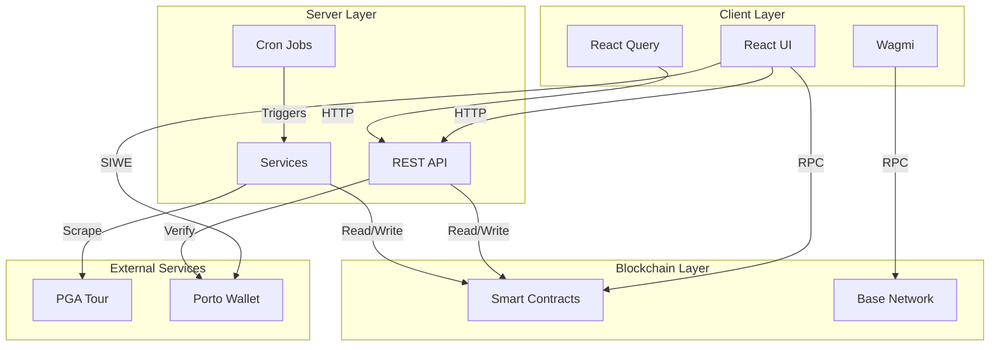
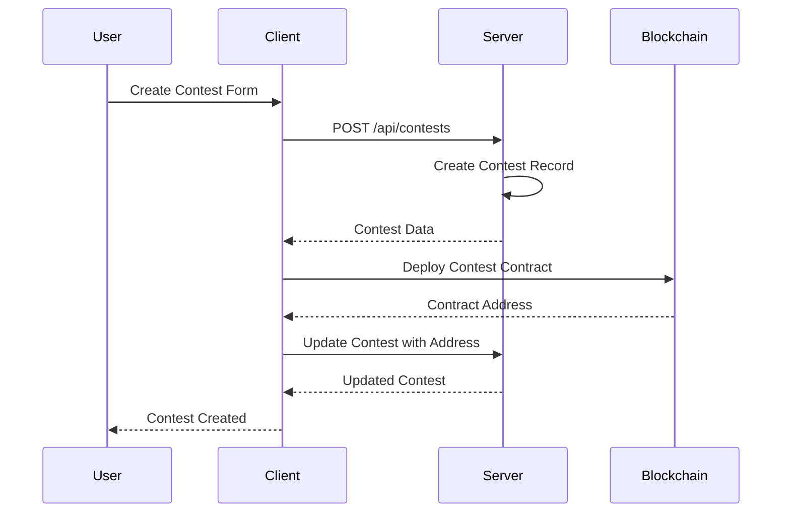
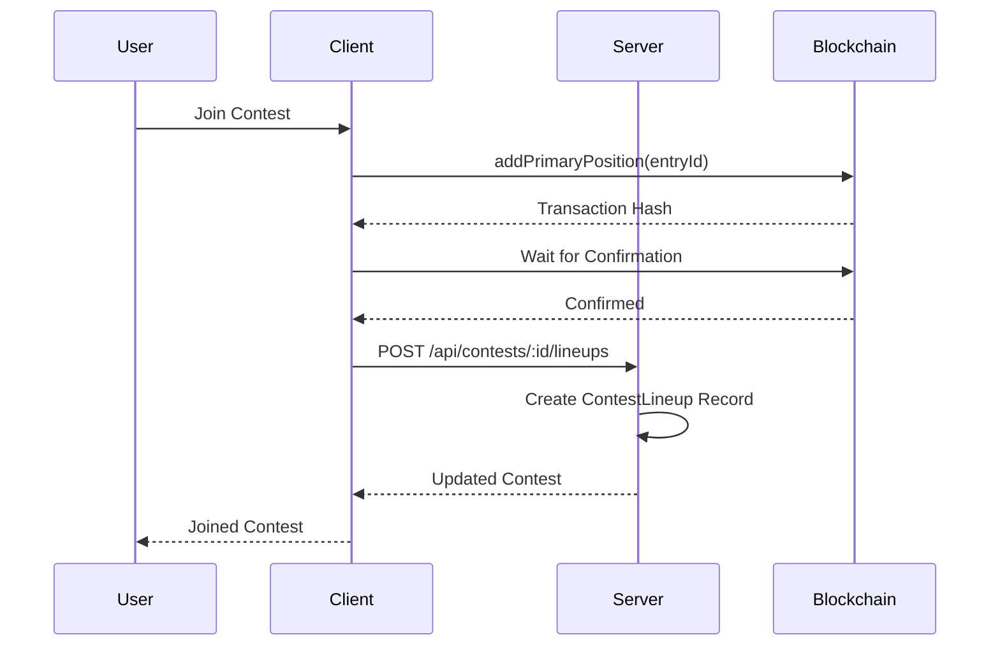
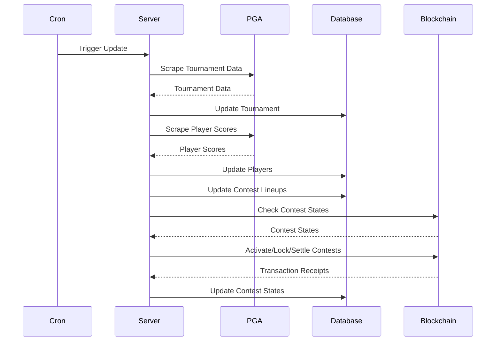

# Cross-Layer Interactions

## System Architecture Overview

## Layer Interactions

### Client ↔ Server

#### Authentication Flow
1. Client requests SIWE nonce from server
2. Client signs message with wallet
3. Client sends signature to server
4. Server verifies signature via Porto
5. Server issues JWT cookie
6. Client includes cookie in subsequent requests

#### Data Flow
- **Client → Server**: HTTP requests (GET, POST, PUT, DELETE)
- **Server → Client**: JSON responses
- **Caching**: React Query caches server responses
- **Real-time**: Polling for updates (token balances)

### Client ↔ Blockchain

#### Read Operations
- **Client → Blockchain**: RPC calls via Wagmi
- **Blockchain → Client**: Contract state data
- **Caching**: Wagmi caches contract reads
- **Polling**: Token balances polled every 30 seconds

#### Write Operations
- **Client → Wallet**: Transaction signing request
- **Wallet → Client**: Signed transaction
- **Client → Blockchain**: Transaction broadcast
- **Blockchain → Client**: Transaction receipt

### Server ↔ Blockchain

#### Read Operations
- **Server → Blockchain**: RPC calls via viem
- **Blockchain → Server**: Contract state data
- **Usage**: Contest state synchronization, balance checks

#### Write Operations
- **Server → Blockchain**: Oracle/admin transactions
- **Blockchain → Server**: Transaction receipts
- **Usage**: Contest lifecycle management (activate, lock, settle, close)

### Server ↔ External Services

#### PGA Tour Integration
- **Server → PGA Tour**: Web scraping
- **PGA Tour → Server**: Tournament data, player scores
- **Frequency**: Every 5 minutes via cron

#### Porto Integration
- **Server → Porto**: Signature verification
- **Porto → Server**: Verification result
- **Usage**: SIWE authentication

## Data Flow Across Layers

### Contest Creation Flow

### Contest Join Flow

### Tournament Update Flow

## Integration Points

### Authentication Integration
- **Client**: Wallet connection (Wagmi)
- **Server**: SIWE verification (Porto)
- **Blockchain**: Wallet address validation

### Contest State Synchronization
- **Blockchain**: Source of truth for contest state
- **Server**: Mirrors blockchain state in database
- **Client**: Reads from both (blockchain for real-time, server for historical)

### Token Operations
- **Client**: Initiates token operations
- **Blockchain**: Executes operations
- **Server**: Tracks operations (if needed)

### Tournament Data
- **External**: PGA Tour website
- **Server**: Scrapes and stores data
- **Client**: Reads from server

## Data Consistency

### Contest State
- **Blockchain**: Authoritative source
- **Server**: Mirrors blockchain state
- **Client**: Reads from blockchain for current state
- **Sync**: Server updates database after blockchain operations

### User Data
- **Server**: Authoritative source
- **Client**: Reads from server
- **Blockchain**: Wallet addresses only

### Tournament Data
- **Server**: Authoritative source
- **Client**: Reads from server
- **External**: PGA Tour (scraped by server)

## Error Handling Across Layers

### Client Errors
- **Network Errors**: Retry logic in React Query
- **Blockchain Errors**: User-friendly messages
- **Server Errors**: Displayed to user

### Server Errors
- **Database Errors**: Logged and handled gracefully
- **Blockchain Errors**: Retry logic for transient failures
- **External API Errors**: Fallback behavior

### Blockchain Errors
- **Transaction Failures**: Caught and displayed
- **RPC Errors**: Retry logic
- **Network Errors**: User notification

## Security Considerations

### Authentication
- **Client**: Wallet signature
- **Server**: Signature verification via Porto
- **Blockchain**: Address validation

### Authorization
- **Server**: JWT-based authorization
- **Blockchain**: Contract-based permissions
- **Client**: Route protection

### Data Validation
- **Client**: Form validation (Yup/Zod)
- **Server**: Schema validation (Zod)
- **Blockchain**: Contract validation

## Performance Considerations

### Caching Strategy
- **Client**: React Query caches server data
- **Client**: Wagmi caches blockchain data
- **Server**: No caching (database is cache)

### Polling Strategy
- **Client**: Token balances (30 seconds)
- **Server**: Tournament updates (5 minutes)
- **Blockchain**: Block-based updates

### Optimization
- **Prefetching**: Tournament data on app load
- **Lazy Loading**: Route-based code splitting
- **Batch Operations**: Server batches contest operations

## Monitoring and Observability

### Client Monitoring
- **PostHog**: User analytics and error tracking
- **Console Logging**: Development debugging

### Server Monitoring
- **Console Logging**: Request/error logging
- **Cron Logging**: Job execution logs

### Blockchain Monitoring
- **Transaction Tracking**: Via Wagmi
- **Event Listening**: (If implemented)

## Future Integration Considerations

### Real-time Updates
- **WebSockets**: For live tournament updates
- **Contract Events**: For contest state changes

### Offline Support
- **Service Workers**: For offline functionality
- **Local Storage**: For offline data

### Multi-chain Support
- **Current**: Base and Base Sepolia
- **Future**: Additional chains via Wagmi

