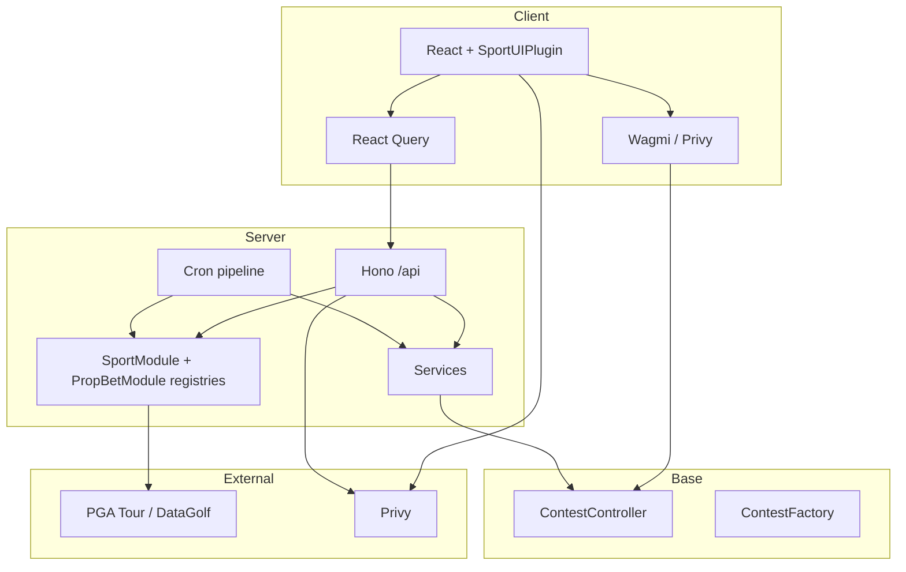
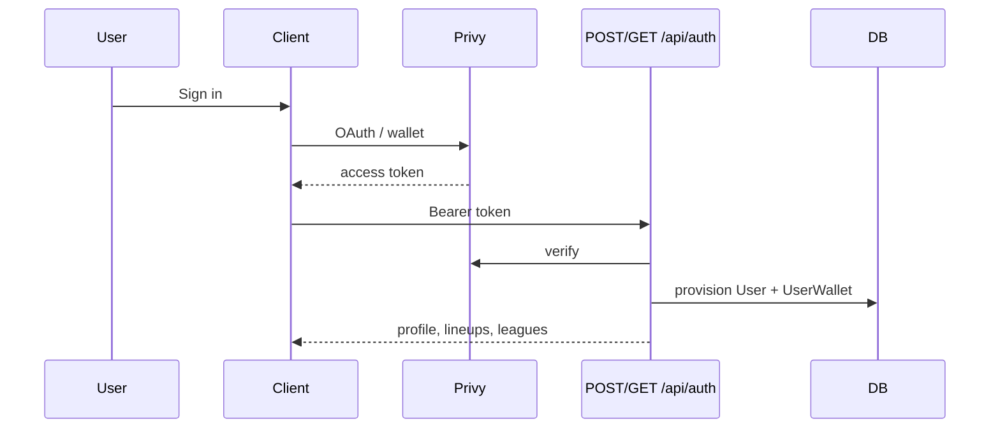
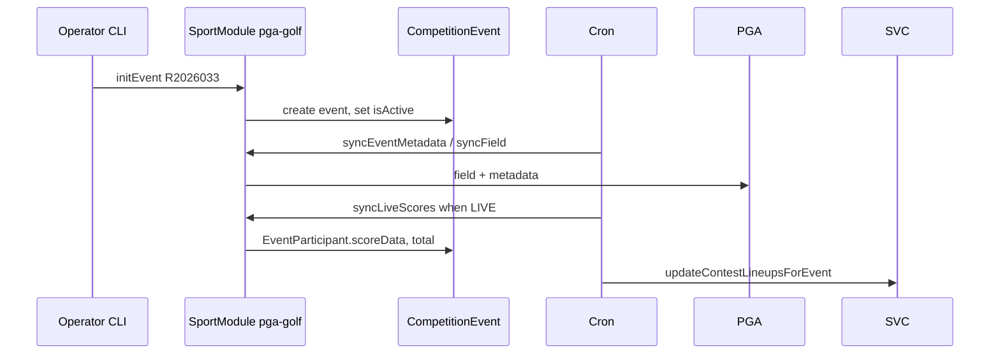
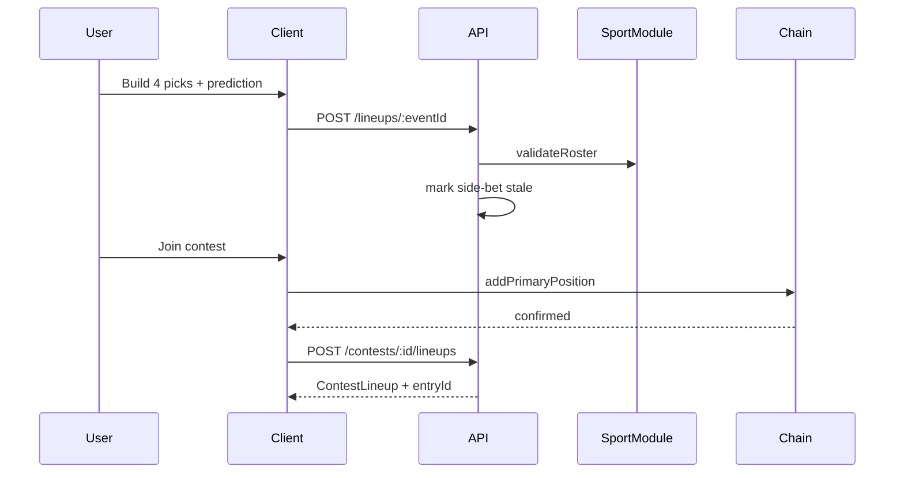
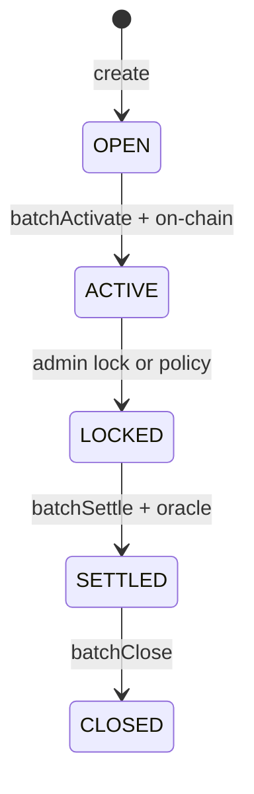
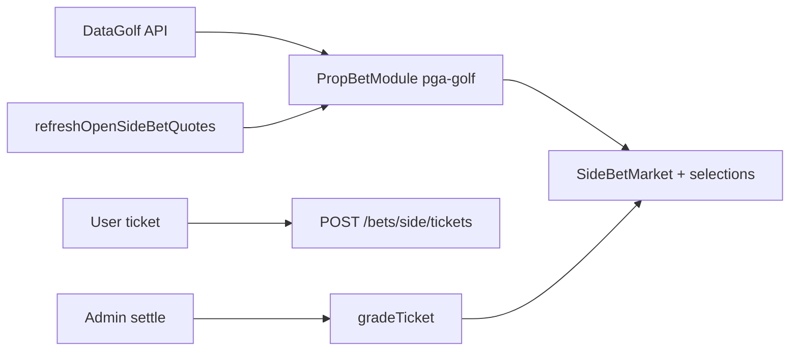
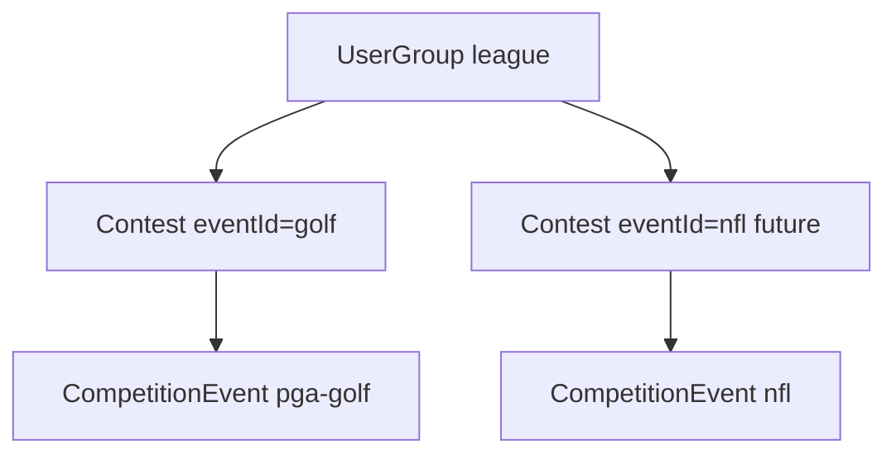

# Cross-layer interactions (v4)

End-to-end flows across client, server, chain, and external services. Terminology: **event** (not tournament), **lineup** (not tournament lineup).

---

## System overview

```mermaid
graph TB
  subgraph client[Client]
    UI[React + SportUIPlugin]
    RQ[React Query]
    WAGMI[Wagmi / Privy]
  end

  subgraph server[Server]
    API[Hono /api]
    REG[SportModule + PropBetModule registries]
    SVC[Services]
    CRON[Cron pipeline]
  end

  subgraph chain[Base]
    CC[ContestController]
    FACTORY[ContestFactory]
  end

  subgraph external[External]
    PGA[PGA Tour / DataGolf]
    PRIVY[Privy]
  end

  UI --> RQ
  RQ --> API
  UI --> WAGMI
  WAGMI --> CC
  API --> REG
  API --> SVC
  SVC --> CC
  CRON --> REG
  CRON --> SVC
  REG --> PGA
  UI --> PRIVY
  API --> PRIVY
```

---

## Identity & auth

```mermaid
sequenceDiagram
  participant User
  participant Client
  participant Privy
  participant API as POST/GET /api/auth
  participant DB

  User->>Client: Sign in
  Client->>Privy: OAuth / wallet
  Privy-->>Client: access token
  Client->>API: Bearer token
  API->>Privy: verify
  API->>DB: provision User + UserWallet
  API-->>Client: profile, lineups, leagues
```

- **Authoritative user record:** Postgres (`User`, `UserWallet`)
- **Authoritative wallet for txs:** Privy-connected address on chosen chain
- **Staff:** `role` on user → `AdminRoute` / `/api/admin`

---

## Event lifecycle (golf example)

```mermaid
sequenceDiagram
  participant Ops as Operator CLI
  participant Mod as SportModule pga-golf
  participant DB as CompetitionEvent
  participant Cron
  participant PGA

  Ops->>Mod: initEvent R2026033
  Mod->>DB: create event, set isActive
  Cron->>Mod: syncEventMetadata / syncField
  Mod->>PGA: field + metadata
  Cron->>Mod: syncLiveScores when LIVE
  Mod->>DB: EventParticipant.scoreData, total
  Cron->>SVC: updateContestLineupsForEvent
```

| Phase | Server status | Client sees |
|-------|---------------|-------------|
| Pre-event | `SCHEDULED` | Editable lineups, OPEN contests |
| Live | `LIVE` | Scores update ~5 min; contests ACTIVE |
| Complete | `COMPLETE` | Lineups locked; settlement runs |

Init: `pnpm run service:init-event pga-golf R2026033`  
Ops runbook: [docs/sports/golf/event-activation-runbook.md](../docs/sports/golf/event-activation-runbook.md)

---

## Lineup → contest entry

```mermaid
sequenceDiagram
  participant User
  participant Client
  participant API
  participant Mod as SportModule
  participant Chain

  User->>Client: Build 4 picks + prediction
  Client->>API: POST /lineups/:eventId
  API->>Mod: validateRoster
  API->>API: mark side-bet stale
  User->>Client: Join contest
  Client->>Chain: addPrimaryPosition
  Chain-->>Client: confirmed
  Client->>API: POST /contests/:id/lineups
  API-->>Client: ContestLineup + entryId
```

- **Lineup** is per user per event with optional `contestId`; contest lobby always sets it on create. Each contest keeps an isolated lineup copy (clone on join when `contestId` mismatches).
- **ContestLineup** links lineup to a specific contest with on-chain `entryId`

---

## Contest lifecycle & settlement

```mermaid
stateDiagram-v2
  [*] --> OPEN: create
  OPEN --> ACTIVE: batchActivate + on-chain
  ACTIVE --> LOCKED: admin lock or policy
  LOCKED --> SETTLED: batchSettle + oracle
  SETTLED --> CLOSED: batchClose
```

| Layer | Responsibility |
|-------|----------------|
| Chain | Deposits, entry positions, oracle `settle`, payouts |
| Server | Mirror status, rank entries via `SportModule.rankEntries`, push oracle tx |
| Client | Join/leave txs, display ranks from server + chain reads |

Settlement uses aggregated lineup scores from `EventParticipant.total` and sport tie-break rules.

---

## Cron pipeline (server-only)

Every 5 minutes (`ENABLE_CRON=true`):

1. For each active event → `runSportEventPipeline` (plugin sync + lineup scores)
2. `refreshOpenSideBetQuotes` (DataGolf → `PropBetModule`)
3. `batchActivateContests` / `batchSettleContests` / `batchCloseContests`
4. `batchSyncReferralGraph`

Client does **not** trigger cron; it benefits from fresher scores and contest status on next query/refetch.

Side-bet **lock / settle / close** are admin API actions, not cron.

---

## Side bets (prop markets)

```mermaid
flowchart LR
  DG[DataGolf API] --> Mod[PropBetModule pga-golf]
  Mod --> DB[SideBetMarket + selections]
  Cron[refreshOpenSideBetQuotes] --> Mod
  User[User ticket] --> API[POST /bets/side/tickets]
  Admin[Admin settle] --> Grade[gradeTicket]
  Grade --> DB
```

- One market per lineup (4 picks required for golf parlay)
- Grading: `PropBetModule.gradeTicket` — "N of 4 finish top X"
- Client reads market via `GET /bets/side/lineup/:lineupId/market`

---

## Leagues (cross-sport)

```mermaid
flowchart TB
  UG[UserGroup league] --> C1[Contest eventId=golf]
  UG --> C2[Contest eventId=nfl future]
  C1 --> E1[CompetitionEvent pga-golf]
  C2 --> E2[CompetitionEvent nfl]
```

- League has **no** `sportId`
- `GET /userGroups/:id/contests` returns contests across events with `eventSummary`
- Client: `GroupedContestList`, `CreateContestEventPicker`

---

## Email program

| Trigger | Data source |
|---------|-------------|
| Welcome, reminders, blasts | `lib/email/*` |
| Event context | `lib/email/data/event.ts` → active `CompetitionEvent` |
| Dedupe | `EmailSendLog.dedupeKey` + `eventId` |

Admin test: `POST /api/admin/email/test`.  
Scripts: `pnpm --filter server run script:send-blast ...`

---

## Data authority

| Data | Source of truth |
|------|-----------------|
| User profile | Server DB |
| Active event, scores, lineups | Server DB (synced from sport APIs) |
| Contest ranks / timeline | Server DB (derived from scores + chain) |
| Deposits, entry ownership, payouts | On-chain contracts |
| Contest status | Both — server mirrors after chain ops |
| Side-bet odds | Server DB (ingested quotes) |
| Auth session | Privy |

---

## Consistency & failure modes

| Scenario | Behavior |
|----------|----------|
| Tx succeeds, API fails | User may need support reconcile; client should retry API record |
| API succeeds, tx fails | No `ContestLineup` created; user sees error |
| Stale React Query cache | Refetch on focus; 5m poll on active event |
| Cron overlap | `pipelineRunning` guard skips duplicate run |
| No active event | `GET .../active` → 404; client empty state |

---

## Security boundaries

| Layer | Control |
|-------|---------|
| Client | Privy session, route guards, form validation |
| API | Bearer verification, Zod bodies, `requireEventEditable` |
| Admin | Staff role + separate batch endpoints |
| Chain | Contract access control, oracle role on server |

---

## Observability

| Layer | Tooling |
|-------|---------|
| Client | PostHog (if configured), React Query DevTools |
| Server | Console logs, cron step logging |
| Chain | Tx hashes in UI, indexed in `OnchainPayment` |

---

## Phase 10 cutover (planned)

Legacy `/api/tournaments` and `/api/lineup` return 501. Client legacy bridge (`golfEventAdapter`, `useTournamentData`) is removed; production cutover uses `migrate-from-legacy.ts` for data only.
