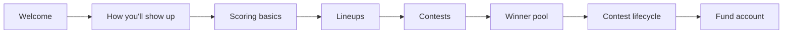

---
# Onboarding content — tracked in repo (implementation todos for reference)
name: Onboarding content sketch
overview: 'A stepped, one-primary-action-per-screen onboarding narrative for Bet the Cut: draft headlines, body copy, and CTAs aligned with existing FAQ/product terms (Stableford, lineups, contests, winner pool / secondary market, CUT, Privy).'
todos:
  - id: lock-terminology
    content: 'Step 2 framing: “How you’ll show up” (display name + color; lineup labels programmatic)'
    status: completed
  - id: trim-scope
    content: 'v1: 8 screens; winner pool (secondary market) after contests; lifecycle included; leagues deferred'
    status: completed
  - id: fund-cta
    content: Pick final CTA targets for last step (Account vs Connect vs both)
    status: pending
  - id: implement-followup
    content: 'Implementation: routes, persistence, AuthContext/settings flag'
    status: pending
---

# Onboarding flow — content sketch and screen map

**Canonical copy (git):** this file, [`spec/onboarding-content-plan.md`](onboarding-content-plan.md). A Cursor Plans mirror may exist at `~/.cursor/plans/onboarding_content_sketch_10bab010.plan.md`—edit **this** file when you want the repo to stay authoritative.

## Product alignment (so copy stays honest)

- **Display identity**: [`UserSettings`](../client/src/components/user/UserSettings.tsx) edits **display name** and **accent color** (`user.settings.color`). Contests and leaderboards show you as _name + color_ (see [`ContestEntryList`](../client/src/components/contest/ContestEntryList.tsx)).
- **Lineups**: A **lineup** is a set of **4 golfers** for a **specific tournament** ([`TournamentLineup`](../server/prisma/schema.prisma)). Lineup labels are assigned programmatically for now. You can have **multiple lineups**; each can be entered into contests ([FAQ](../client/src/pages/FAQPage.tsx)).
- **Contests**: Tournament-scoped competitions; **entry fees in CUT**; **primary prize pool** for lineup finishers; lineups **lock when the tournament starts**. **v1 onboarding** includes a **winner pool** screen after contests—the **secondary prediction market** on which lineup wins (UI: “Winner Pool” in e.g. [`ContestResultsPanel`](../client/src/components/contest/ContestResultsPanel.tsx)), not a tutorial on **primary payout tiers** (those stay in [FAQ](../client/src/pages/FAQPage.tsx)). Then **contest lifecycle** (OPEN → ACTIVE → LOCKED → SETTLED → CLOSED) ties together lineup locks and when the prediction market is open; see [FAQ contest-status section](../client/src/pages/FAQPage.tsx).
- **Funding last**: Tie to **Privy + Account** and **CUT** for entries/prizes ([FAQ Account & Wallet](../client/src/pages/FAQPage.tsx)).

**Step 2 framing (locked)**: **“How you’ll show up”**—display **name** + **accent color** (`User.name`, `user.settings.color`). No “team name” in onboarding; lineup labels stay programmatic.

---

## Suggested flow (8 screens for v1)

One **primary action** per screen; everything else is **skippable** or **Continue** only if you want low friction.

**Leagues / private groups** are **deferred**—revisit when league join flows are a priority.

**Winner pool** (#6)—the **secondary prediction market**—sits **after contests** so “enter a lineup” and “predict the winning lineup” stay distinct before lifecycle timing. **Contest lifecycle** (#7) is **in v1**—not optional to cut.

---

## Screen-by-screen draft copy

Tone: short sentences, one idea per paragraph, friendly—not legalistic. Adjust brand voice as you like.

### 1. Welcome

- **Headline**: Welcome to Bet the Cut
- **Body**: Pick four PGA Tour players each week, score using Modified Stableford, and compete in contests with real stakes. This short tour shows you how it works—a few minutes.
- **Primary CTA**: Start
- **Secondary**: Skip for now

### 2. How you’ll show up (display name + color)

- **Headline**: How you’ll show up
- **Body**: This is how other players see you on leaderboards and results: your **name** and a **color** accent. You can change these anytime in Account settings.
- **Action**: Single field **Display name** + **Color** picker (reuse patterns from [`UserSettings`](../client/src/components/user/UserSettings.tsx)).
- **Primary CTA**: Save and continue
- **Microcopy (helper)**: Pick a color you’ll recognize in a crowded leaderboard.

### 3. Scoring (context only, or tiny quiz optional)

- **Headline**: How scoring works
- **Body**: Each golfer earns **Modified Stableford** points per hole (birdies up, bogeys down—eagles and doubles matter a lot). **Bonuses** apply for making the cut and top finishes. Your **lineup score** is the **sum of all four players’** points for the week.
- **Optional one-liner**: Rankings update regularly while tournaments are live.
- **Primary CTA**: Got it

_(Optional v2: single multiple-choice “What counts toward your score?”—not required for v1.)_

### 4. Lineups

- **Headline**: Your lineup is your team for the week
- **Body**: For each tournament, you build a **lineup** of **four golfers**. You can create **more than one** lineup—useful when you join multiple contests or want different strategies. **Save before tee-off**; after the tournament starts, that lineup is **locked**.
- **Primary CTA**: Continue
- **Secondary CTA (strong)**: **Create a lineup** → deep-link to Lineups page (only if you want an action here; otherwise keep this screen explain-only to preserve “one concept per step”).

### 5. Contests

- **Headline**: Contests are where you compete
- **Body**: A **contest** is tied to **one tournament**. You **enter with a lineup** and pay an **entry fee in CUT**. Everyone’s entries feed the **primary prize pool** for the **fantasy competition**—**highest lineup scores** win that pool; **ties split** their share. (How that pool is split by place is in the FAQ.)
- **Primary CTA**: Continue
- **Link text**: Learn more → FAQ “Contests” / “How are winners determined?” / “Payout structure”

### 6. Winner pool (secondary prediction market)

- **Headline**: The winner pool
- **Body**: Each contest also runs a **winner pool**—a **secondary prediction market** on **which lineup** will win the contest. You’re not swapping golfers here; you’re taking **positions** (shares) on entries you think will finish on top. **Prices move** as the tournament and sentiment change. When the contest **settles**, holders of the **winning prediction** can claim **winner pool** payouts—separate from **primary** lineup prizes. **When you can buy, sell, or only buy** follows contest status (next screen).
- **Primary CTA**: Continue
- **Link text**: Learn more → FAQ “Contest Status & Timeline” / prediction-market bullets

_(Stay conceptual on this screen; no LMSR math. Primary payout tiers are FAQ-only—not this step.)_

### 7. Contest lifecycle

- **Headline**: What “Open” and “Locked” mean
- **Body**: While a contest is **Open**, you can usually join, adjust lineups, and use the prediction market. When things **lock**, entries and lineups freeze and you’re racing the live leaderboard. **Settled** means results are final and winners can **claim**.
- **Primary CTA**: Continue

_(Pull exact status names from your UI; FAQ table is the source of truth.)_

### 8. Fund your account (last)

- **Headline**: You’re ready—add funds when you want to play for stakes
- **Body**: Sign-in uses **Privy** (email, phone, or wallet—however the app is set up). **CUT** is what you use for **entries** and what you **win**. Connect or top up from your **Account** page when you’re ready; you can explore lineups and contests first.
- **Primary CTA**: Go to Account / Connect wallet _(match your actual route, e.g. [`ConnectPage`](../client/src/pages/ConnectPage.tsx) or Account)_
- **Secondary**: Finish and go home

### Deferred (not in v1): Leagues / private groups

_Saved for a later iteration._

- **Headline**: Play with your crew
- **Body**: Some contests are for **everyone**; others are for a **league or group** you’re invited to. Same rules—just a smaller table of rivals.
- **Primary CTA**: Continue

---

## Content principles to carry into implementation

- **One job per screen**: headline states the job; body is 2–4 short bullets or one short paragraph.
- **Defer money**: no wallet pressure until the last step; earlier steps build competence and motivation.
- **Reuse FAQ**: link “Learn more” to [FAQ](../client/src/pages/FAQPage.tsx) sections instead of duplicating long tables (payout %, full status matrix).
- **Persist progress**: if you store `onboardingStep` or `onboardingCompletedAt` on the user, users can resume; optional for v1.

---

## Open choices (no blocker—pick when you implement)

| Choice       | Options                                                          |
| ------------ | ---------------------------------------------------------------- |
| Lineups step | Explain-only vs **CTA → Lineups** (second action on that screen) |

**Decided**: **8 screens** for v1 (**winner pool** / secondary market **after contests**; lifecycle **included**; leagues deferred). Step 2 framing: **“How you’ll show up”**.

---

## Implementation preview (for a follow-up plan, not this doc)

- New route(s) e.g. `/onboarding` with a small step machine; gate with `user.settings.onboardingComplete` or similar after you add schema/API.
- Reuse `updateUser` / `updateUserSettings` from [`AuthContext`](../client/src/contexts/AuthContext.tsx) for the identity step.
- No new markdown task files unless you ask for them.
