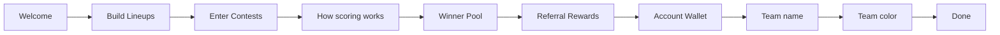

# Onboarding

Canonical copy and screen map for `/onboarding` ([`OnboardingPage`](../client/src/pages/OnboardingPage.tsx)).

Tone in the live flow: short product sentences, informal primary CTAs (`next`, `ok`, `got it`, `nice`, `sweet`). Chrome is shared: **Step N of 10**, a progress bar, and **Exit** on every screen.

## Gate

New accounts are created with `user.settings.onboardingDismissed: false` ([`privyUserProvisioning`](../server/src/lib/privyUserProvisioning.ts)). [`OnboardingRedirectGate`](../client/src/components/common/OnboardingRedirectGate.tsx) sends an authenticated user to `/onboarding` when that flag is exactly `false`. `/onboarding` and `/connect` are excluded so login and the flow itself still work.

**Skip for now**, **Exit**, and the final **View contests** action set `onboardingDismissed: true` via `updateUserSettings`. There is no stored step index; a return visit starts at step 1.

After dismiss, navigation is:

1. The `from` location passed into the gate (the page they were heading to), if present
2. Else a pending league invite → `/leagues/join/:code`
3. Else `/`

The final button label is **View contests**; it uses that same dismiss path, not a hard link to `/contests`.

## Flow

```mermaid
flowchart LR
  welcome[Welcome]
  lineups[Build Lineups]
  contests[Enter Contests]
  scoring[How scoring works]
  winnerPool[Winner Pool]
  referrals[Referral Rewards]
  funds[Account Wallet]
  teamName[Team name]
  teamColor[Team color]
  done[Done]
  welcome --> lineups --> contests --> scoring --> winnerPool
  winnerPool --> referrals --> funds --> teamName --> teamColor --> done
```

Identity (name + color) is two screens near the end. Name writes `User.name`. Color writes `user.settings.color` from the same ten swatches as Account → User Display.

---

## Screen-by-screen copy

Copy below is what the UI shows today.

### 1. Welcome

- **Headline**: PLAYTHECUT / Fantasy Golf (logo + wordmark)
- **Body**: Welcome to **Play The Cut**! Let's get started...
- **Primary CTA**: Start
- **Secondary**: Skip for now

### 2. Build Lineups

- **Headline**: Build Lineups
- **Body**: For each tournament, you build a lineup of **four golfers**. You can choose any four golfers from the field - no salary caps or restrictions.
- **Primary CTA**: next
- **Secondary**: Back

### 3. Enter Contests

- **Headline**: Enter Contests
- **Body**: A **contest** is a fantasy competition for a single tournament. Each lineup you enter is a separate buy-in; those fees build the **prize pool**. When the event wraps, **payouts** go to the best-scoring lineups.
- **Body (2)**: You can join **multiple contests** in a week and enter **more than one lineup** in the same contest.
- **Primary CTA**: ok
- **Secondary**: Back

### 4. How scoring works

- **Headline**: How scoring works
- **Body**: Golfers earn points based on their performance on each hole:

| Result | Points |
| --- | --- |
| Hole-in-one | +10 |
| Double Eagle or better | +15 |
| Eagle | +5 |
| Birdie | +2 |
| Par | 0 |
| Bogey | −1 |
| Double bogey or worse | −3 |

- **Body (2)**: There are also bonus points:

| Bonus | Points |
| --- | --- |
| Making the cut | +3 |
| 1st place finish | +10 |
| 2nd place finish | +5 |
| 3rd place finish | +3 |

- **Primary CTA**: got it
- **Secondary**: Back

### 5. Winner Pool

- **Headline**: the Winner Pool
- **Body**: Each contest also contains a **Winner Pool**, a parimutuel market where you can back **the lineup you think will win**. Odds move as money enters each lineup.
- **Primary CTA**: nice
- **Secondary**: Back

### 6. Referral Rewards

Same framing as [`ReferralsPage`](../client/src/pages/account/ReferralsPage.tsx).

- **Headline**: Referral Rewards
- **Body**: Play The Cut is different—**no fees, no ads, no middlemen**. We grow through referrals, so when you bring in new players, you earn Referral Rewards.
- **Body (2)**: **Referral Rewards** make Play The Cut a team sport. As friends invite friends, your network grows—and **when they win, you win too**. Share your referral link under Referral Network to start building your team!
- **Primary CTA**: sweet
- **Secondary**: Back

### 7. Account Wallet

- **Headline**: Account Wallet
- **Body**: Your Play The Cut wallet is yours—you stay in control of your funds. Contests use **USDC**, a digital dollar, on the Base network. Add USDC when you’re ready to play, and send it out anytime.
- **Primary CTA**: nice
- **Secondary**: Back

### 8. Team name

- **Headline**: Your team name
- **Body**: This is the name other players see on leaderboards and results. You can change it anytime in Account settings.
- **Field label**: TEAM NAME
- **Placeholder**: Enter your team name
- **Primary CTA**: Save & Continue
- **Secondary**: Back

Saves `User.name` (trim; empty keeps the current name). Account settings label the same field **Name**, not team name.

### 9. Team color

- **Headline**: Your team color
- **Body**: Pick an accent color that appears next to your team name so you're easy to spot on leaderboards.
- **Action**: Ten-swatch color picker (`user.settings.color`)
- **Primary CTA**: Save & Continue
- **Secondary**: Back

### 10. Done

- **Headline**: Done!
- **Body**: You're ready to play. Build a lineup for this week's tournament whenever you want—then enter contests when you have funds in your account.
- **Primary CTA**: View contests
- **Secondary**: Back

---

## Implementation

| Piece | Behavior |
| --- | --- |
| Route | `/onboarding` behind `ProtectedRoute` |
| Persistence | `settings.onboardingDismissed` only; no resume-at-step |
| Identity writes | `updateUser({ name })`, `updateUserSettings({ color })` |
| League invites | Captured before auth; applied on dismiss if no `from` location |
| Sports | Welcome subtitle is **Fantasy Golf**; later screens are golf-framed (four golfers, Stableford table) |

Leagues are not a dedicated onboarding screen. Invitees land on `/leagues/join/:code` after they finish or skip.

## Open decisions

- Whether identity should say **name** / **color** (Account settings) or **team name** / **team color**.
- Whether the last CTA should go to `/contests` or keep the dismiss-resume path.
- Whether primary CTAs stay informal and lowercase.
