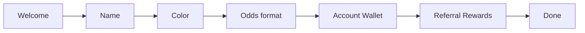

# Onboarding

Canonical copy and screen map for `/onboarding` ([`OnboardingPage`](../client/src/pages/OnboardingPage.tsx)).

The first onboarding is account setup: name, color, odds format, wallet, and referrals. It does not teach a sport.

Tone in the live flow: short product sentences. Save steps use **Save & Continue**. Wallet and referrals keep the informal primary CTAs (`nice`, `sweet`). Chrome is shared: **Step N of 7**, a progress bar, and **Exit** on every screen.

## Gate

New accounts are created with `user.settings.onboardingDismissed: false` ([`privyUserProvisioning`](../server/src/lib/privyUserProvisioning.ts)). [`OnboardingRedirectGate`](../client/src/components/common/OnboardingRedirectGate.tsx) sends an authenticated user to `/onboarding` when that flag is exactly `false`. `/onboarding` and `/connect` are excluded so login and the flow itself still work.

**Skip for now**, **Exit**, and the final **Continue** action set `onboardingDismissed: true` via `updateUserSettings`. There is no stored step index; a return visit starts at step 1.

After dismiss, navigation is:

1. The `from` location passed into the gate (the page they were heading to), if present
2. Else a pending league invite → `/leagues/join/:code`
3. Else `/`

The final button label is **Continue**. It uses that same dismiss path.

## Flow

```mermaid
flowchart LR
  welcome[Welcome]
  name[Name]
  color[Color]
  odds[Odds format]
  wallet[Account Wallet]
  referrals[Referral Rewards]
  done[Done]
  welcome --> name --> color --> odds --> wallet --> referrals --> done
```

Identity matches Account → User Display: **Name**, **Color**, and **Odds format**. Name writes `User.name`. Color writes `user.settings.color` from the same ten swatches. Odds format writes `user.settings.oddsFormat` from the same three options (American, Decimal, English).

---

## Screen-by-screen copy

Copy below is what the UI shows today.

### 1. Welcome

- **Headline**: PLAYTHECUT (logo + wordmark)
- **Body**: Welcome to **Play The Cut**!
- **Body (2)**: Let's set up your account.
- **Primary CTA**: Start
- **Secondary**: Skip for now

### 2. Name

- **Headline**: Your name
- **Body**: This is the name other players see on leaderboards and results. You can change it anytime in Account settings.
- **Field label**: Name
- **Placeholder**: Enter your name
- **Primary CTA**: Save & Continue
- **Secondary**: Back

Saves `User.name` (trim; empty keeps the current name).

### 3. Color

- **Headline**: Your color
- **Body**: Pick an accent color that appears next to your name so you're easy to spot on leaderboards.
- **Action**: Ten-swatch color picker (`user.settings.color`)
- **Primary CTA**: Save & Continue
- **Secondary**: Back

### 4. Odds format

- **Headline**: Odds format
- **Body**: Choose how odds are shown on your account. You can change this anytime in Account settings.
- **Action**: American (`+200`), Decimal (`3.00`), or English (`2/1`) — same control as Account → User Display (`user.settings.oddsFormat`)
- **Primary CTA**: Save & Continue
- **Secondary**: Back

### 5. Account Wallet

- **Headline**: Account Wallet
- **Body**: Your Play The Cut wallet is yours—you stay in control of your funds. Contests use **USDC**, a digital dollar, on the Base network. Add USDC when you’re ready to play, and send it out anytime.
- **Primary CTA**: nice
- **Secondary**: Back

No deposit form.

### 6. Referral Rewards

Same framing as [`ReferralsPage`](../client/src/pages/account/ReferralsPage.tsx).

- **Headline**: Referral Rewards
- **Body**: Play The Cut is different—**no fees, no ads, no middlemen**. We grow through referrals, so when you bring in new players, you earn Referral Rewards.
- **Body (2)**: **Referral Rewards** make Play The Cut a team sport. As friends invite friends, your network grows—and **when they win, you win too**. Share your referral link under Referral Network to start building your team!
- **Primary CTA**: sweet
- **Secondary**: Back

No share action.

### 7. Done

- **Headline**: Done!
- **Body**: Your account is ready.
- **Primary CTA**: Continue
- **Secondary**: Back

---

## Implementation

| Piece | Behavior |
| --- | --- |
| Route | `/onboarding` behind `ProtectedRoute` |
| Persistence | `settings.onboardingDismissed` only; no resume-at-step |
| Identity writes | `updateUser({ name })`, `updateUserSettings({ color, oddsFormat })` |
| League invites | Captured before auth; applied on dismiss if no `from` location |
| Sports | Welcome is the wordmark only. Later screens are account setup, not a sport tutorial. |

Leagues are not a dedicated onboarding screen. Invitees land on `/leagues/join/:code` after they finish or skip.
