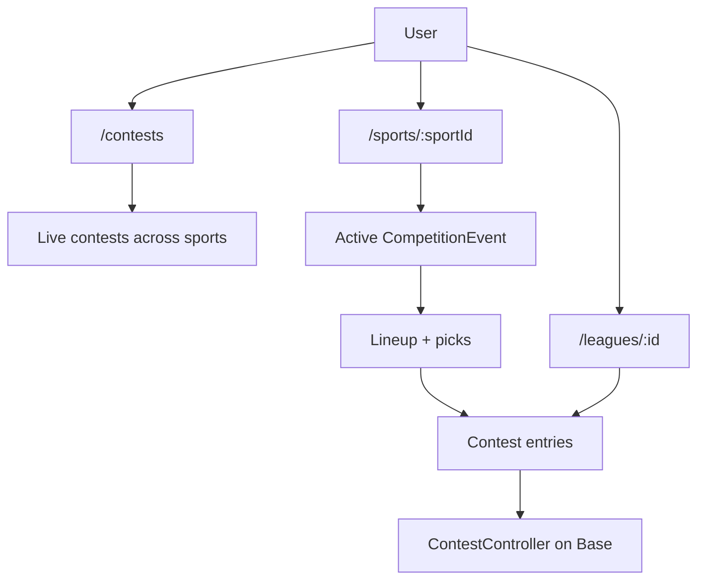

# Platform overview

Play The Cut is a **multi-sport competition platform**: one app, one database, one deployment. Users pick a sport, build an **event-scoped lineup**, and enter **contests** (public or within a **league**). Account, wallet, and referral graph are shared across sports.

Only **PGA Golf** (`pga-golf`) is fully implemented on v4. The architecture supports additional sports without changing contests, leagues, or on-chain contracts.

---

## Product model



| Concept | Description |
|---------|-------------|
| **Sport** | Registered plugin (`Sport` row). Defines roster/scoring rules JSON. |
| **Event** | One competition instance (`CompetitionEvent`). One **active** event per sport at a time (`isActive`). |
| **Participant** | Competitor identity (`Participant`) — golfer, NFL player, etc. |
| **Event participant** | Competitor in a specific event with live `scoreData` and `total`. |
| **Lineup** | User's roster for one event (`Lineup` + `LineupPick[]`). Optional `prediction` JSON for tie-breaks. |
| **Contest** | Paid competition on one event. Status: `OPEN → ACTIVE → LOCKED → SETTLED → CLOSED`. |
| **Contest lineup** | Entry linking a `lineupId` into a contest (`ContestLineup`). Holds `entryId` (on-chain). |
| **League** | `UserGroup` — cross-sport social group. No `sportId` on the league; each contest has its own `eventId`. |

### Two-layer entry model

```
Lineup (per user, per event — many allowed)
  └── LineupPick[] → EventParticipant
        └── ContestLineup (per contest)
              └── Contest
```

A user builds **one or more lineups per event**, then enters any lineup into **one or more contests** (public + league).

---

## Architecture layers

### 1. Core platform (sport-agnostic)

| Area | Responsibility |
|------|----------------|
| Identity | Privy auth, `User`, `UserWallet`, provisioning |
| Social | `UserGroup` / leagues, invite codes, membership roles |
| Events API | List sports, active event, candidate pool |
| Lineups API | Create/update roster; validate via sport plugin |
| Contests | CRUD, join/leave, timeline, secondary market participants |
| Settlement | Rank entries, derive payouts, oracle + on-chain settle |
| Cron | Multi-sport sync pipeline every 5 minutes |
| Side bets (platform) | `SideBetMarket` / `SideBetTicket` persistence, HTTP, admin batch ops |
| Email | Templates, blasts, `EmailSendLog` keyed by `eventId` |
| Admin | Dashboard, user ops, side-bet reports |

### 2. Sport plugins (`SportModule`)

Per-sport packages implement ingestion, candidates, validation, scoring, ranking, and contest lifecycle gates. See [plugins.md](plugins.md).

**Server:** `server/src/sports/registry.ts`  
**Golf:** `@cut/sport-pga-golf` + `server/src/sports/pga-golf/handlers.ts`

### 3. Prop bet plugins (`PropBetModule`)

Optional per sport — separate from `SportModule`. Golf uses DataGolf round-robin parlays.

**Server:** `server/src/sports/propBetRegistry.ts`  
**Golf:** `packages/sport-pga-golf/src/prop-bet.ts` + `server/src/sports/pga-golf/buildGolfMarketSnapshot.ts`

### 4. Client UI plugins (`SportUIPlugin`)

Sport-specific React components injected into the platform shell (candidate rows, pick detail, prediction field, event summary).

**Client:** `client/src/sports/registry.ts`  
**Golf:** `client/src/sports/pga-golf/`

### 5. On-chain layer

Unchanged and sport-agnostic. `ContestController` / `ContestFactory` on Base. Entries are opaque `entryId` values; oracle supplies `winningEntries` + `payoutBps`.

See [contracts/README.md](../contracts/README.md).

---

## Live vs legacy API surface

| Mounted in `server/src/routes/api.ts` | Status |
|---------------------------------------|--------|
| `/api/sports` | ✅ Live |
| `/api/lineups` | ✅ Live |
| `/api/contests` | ✅ Live |
| `/api/userGroups` | ✅ Live |
| `/api/bets` | ✅ Live (feature flag) |
| `/api/admin` | ✅ Live |
| `/api/auth` | ✅ Live |
| `/api/cron` | ✅ Live |
| `/api/unsubscribe` | ✅ Live |
| `/api/tournaments` | ❌ 501 legacy stub |
| `/api/lineup` | ❌ 501 legacy stub |

---

## Cron pipeline (summary)

Every **5 minutes** when `ENABLE_CRON=true`:

1. For each `CompetitionEvent` where `isActive=true`:
   - `runSportEventPipeline` → sync metadata, field, scores, update contest lineups
2. `refreshOpenSideBetQuotes` (if `SIDE_BETS_ENABLED` + DataGolf key)
3. `batchActivateContests` / `batchSettleContests` / `batchCloseContests`
4. `batchSyncReferralGraph`

Details: [server/cron.md](../server/cron.md)

---

## Client routing (summary)

| Route | Purpose |
|-------|---------|
| `/` | Redirect → `/contests` |
| `/contests` | Multi-sport live contests hub |
| `/sports/:sportId` | Sport hub — active-event contest list |
| `/sports/:sportId/leaderboard` | Sport leaderboard + event header |
| `/contest/:address` | Contest lobby (on-chain address in URL) |
| `/leagues/*` | League list, detail, create, join |
| `/user-groups/*` | Redirect → `/leagues/*` |
| `/account` | Wallet, referrals, settings |

`sportId` is explicit per route: URL param on sport pages, `contest.event.sportId` on contest lobby, or first enabled sport on create forms. No global `SportProvider`.

Details: [client/architecture.md](../client/architecture.md)

---

## Adding a new sport (checklist)

1. `Sport` row in DB (`isEnabled: true`, `rosterRules`, `scoringRules`)
2. Server package implementing `SportModule` + handlers
3. Register in `server/src/sports/registry.ts`
4. Optional: `PropBetModule` + `propBetRegistry.ts`
5. Client `SportUIPlugin` in `client/src/sports/<sport>/`
6. Register in `client/src/sports/registry.ts`
7. Event ingestion CLI / cron hooks

Does **not** require changes to contests, leagues, wallets, referrals, or smart contracts.

---

## Next docs

- [Plugin interfaces and registries](plugins.md)
- [Server layer](../server/architecture.md)
- [Client layer](../client/architecture.md)
