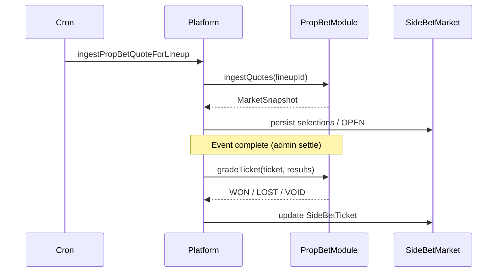

# Plugin system

Shared contracts live in `packages/sport-sdk`. Server and client each maintain a **registry** that maps `sportId` → plugin implementation.

---

## SportModule (server)

**Interface:** `packages/sport-sdk/src/sport-module.ts`  
**Registry:** `server/src/sports/registry.ts` — `getSportModule(sportId)` and `requireSportModule(sportId)`

```typescript
interface SportModule {
  readonly id: string;

  // Event lifecycle
  initEvent(externalId: string): Promise<void>;
  syncEventMetadata(eventId: string): Promise<void>;
  syncParticipantField(eventId: string): Promise<void>;
  syncLiveScores(eventId: string): Promise<void>;
  shouldSyncLiveScores(eventId: string): Promise<boolean>;
  getEventStatus(eventId: string): Promise<"SCHEDULED" | "LIVE" | "COMPLETE">;
  handleWithdrawals?(eventId: string): Promise<void>;

  // Rosters & scoring
  getCandidatePool(eventId: string): Promise<Candidate[]>;
  validateRoster(eventId, picks, rules): Promise<ValidationResult>;
  aggregateLineupScore(eventId, eventParticipantIds): Promise<number>;
  rankEntries(entries): RankedEntry[];

  // Contest lifecycle gates
  shouldActivateContest(eventStatus): boolean;
  shouldSettleContest(eventStatus): boolean;
  derivePayoutVector?(ranked, entryCount): PayoutVector;
}
```

### Golf implementation

| Layer | Location |
|-------|----------|
| Pure logic | `packages/sport-pga-golf/` — ranking, validation, status, candidates, **live score transform** |
| Factory | `createPgaGolfModule(handlers)` in `create-module.ts` |
| IO handlers | `server/src/sports/pga-golf/handlers.ts` — Prisma, PGA APIs, DataGolf |
| CLI | `pnpm run service:init-event pga-golf R2026033` |

Handlers inject all database and external API access so the package stays testable.

### How the platform uses SportModule

| Call site | Usage |
|-----------|--------|
| `GET /sports/:sportId/events/:eventId/candidates` | `getCandidatePool` |
| `POST /api/lineups/:eventId` | `validateRoster` |
| `runSportEventPipeline` | sync hooks + live scores |
| `updateContestLineupsForEvent` | `aggregateLineupScore`, `rankEntries` |
| `settleContest` | `rankEntries`, `derivePayoutVector` |
| `batchActivateContests` / `batchSettleContests` | `shouldActivateContest`, `shouldSettleContest` via event status |

---

## SportUIPlugin (client)

**Interface:** `packages/sport-sdk/src/sport-ui-plugin.ts`  
**Registry:** `client/src/sports/registry.ts`

```typescript
interface SportUIPlugin {
  CandidateRow: React.FC<CandidateRowProps>;       // picker (scheduled card; live delegates to ParticipantRow)
  ParticipantRow: React.FC<ParticipantRowProps>;   // display lists (leaderboard, lineup slots, contest entries)
  ParticipantDetail: React.FC<ParticipantDetailProps>; // detail modal (scorecard header + round tabs + hole table)
  PredictionField?: React.FC<PredictionFieldProps>;
  EventSummary?: React.FC<{ event: CompetitionEventShell }>;
  candidateSortConfig: CandidateSortConfig;        // per-context sort key order for platform lists
}
```

**Candidate sort contexts** (`@cut/sport-sdk` `sortCandidates`):

| Context | Used by | Status handling |
|---------|---------|-----------------|
| `picker` | `CandidatePicker` | Static key order (e.g. golf: OWGR → DataGolf → name) |
| `fieldLeaderboard` | `EventLeaderboardPanel` | `scheduled` vs `active` key lists |
| `lineupPicks` | Lineup cards, contest entry modal/list | `scheduled` vs `active` key lists |

Sport packages populate `Candidate.sortKeys` in `build*Candidates`; export `*CandidateSortConfig` from the sport package and attach to the UI plugin. Platform surfaces call `useCandidateSort(sportId)` → `sort(candidates, context, eventStatus?)`.

`ParticipantRowProps`: `{ candidate, status: EventStatus, onClick?, ownershipPercentage?, eventMetadata? }`. Platform passes `status` from the parent event hook; golf reads `roundDisplay` from `eventMetadata` internally.

`ParticipantDetailProps`: `{ candidate, status: EventStatus, rowTrailing?, onShare?, eventMetadata? }`. Round tab state is owned by the plugin; [`SportParticipantDetailModal`](../../client/src/components/platform/SportParticipantDetailModal.tsx) provides dialog chrome and share URL handling.

Golf also provides `EventDetails` (hero text) used inside `EventSummary`.

### Platform shell (sport-agnostic)

| Component | Role |
|-----------|------|
| `SportEventHeader` | Leaderboard event hero → plugin `EventSummary` (`sportId` prop) |
| `CandidatePicker` | Search/sort over `Candidate[]` |
| `SportLineupPickRow` | Thin wrapper → `SportParticipantRow` in editable lineup slots |
| `SportParticipantRow` | Resolves plugin `ParticipantRow`; passes `status` + optional `eventMetadata` |
| `SportParticipantDetailModal` | Dialog chrome → plugin `ParticipantDetail`; share URL helper |
| `SportPredictionField` | Renders plugin `PredictionField` |
| `CreateContestEventPicker` | Sport + active event for contest create |

Contest lobby renders plugin `EventSummary` in `ContestLobbyView` (not in `AppLayout`).

`useSportUIPlugin(sportId?)` resolves the plugin from an explicit argument or `ContestEventScopeProvider`.

**Client detail:** [sport-ui-plugins.md](../client/sport-ui-plugins.md) — slot purposes, usage map, conventions.

---

## PropBetModule (server, optional per sport)

**Interface:** `packages/sport-sdk/src/prop-bet-module.ts`  
**Registry:** `server/src/sports/propBetRegistry.ts`

```typescript
interface PropBetModule {
  readonly sportId: string;
  ingestQuotes(lineupId: string): Promise<MarketSnapshot | null>;
  gradeTicket(ticket: PropBetTicketShell, results: PropBetResultsShell): "WON" | "LOST" | "VOID";
}
```

Prop bets are **not** part of `SportModule`. The platform owns market/ticket persistence; the plugin owns quote math and grading rules.

### Golf implementation

| Concern | Location |
|---------|----------|
| Grading pure logic | `packages/sport-pga-golf/src/prop-bet.ts` |
| Module factory | `createPgaGolfPropBetModule` |
| DataGolf ingest | `server/src/sports/pga-golf/buildGolfMarketSnapshot.ts` |
| DB persistence | `server/src/services/propBets/persistMarketSnapshot.ts` |
| Orchestration | `server/src/services/propBets/ingestPropBetQuoteForLineup.ts` |
| Settlement | `server/src/services/betting/settleSideBetTicket.ts` → `gradeTicket` |

### Platform side-bet flow



- **Quote refresh:** cron `refreshOpenSideBetQuotes` (not lock/settle/close)
- **Lock / settle / close:** admin panel batch ops (`/api/admin/bets/side/*`)
- **Feature flag:** `SIDE_BETS_ENABLED=true`
- **Roster change:** `markSideBetMarketStaleAfterRosterChange` → cron re-ingests

---

## Shared types (`@cut/sport-sdk`)

Key exports from `packages/sport-sdk/src/types.ts`:

| Type | Purpose |
|------|---------|
| `Candidate` | Lineup picker row (`eventParticipantId`, `displayName`, `sortKeys`, `metadata`) |
| `RosterRules` | `slotCount`, `minPicks`, `maxPicks`, `allowDuplicates` |
| `RankedEntry` | Contest ranking output |
| `PayoutVector` | Basis points per winner |
| `MarketSnapshot` | Prop quote ingest result (`metadata` is sport-specific) |
| `PropBetTicketShell` / `PropBetResultsShell` | Grading inputs |

Client re-exports types from `client/src/sports/types.ts`.
