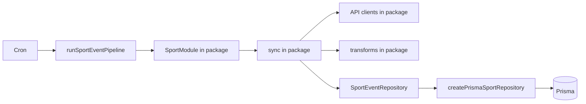

# Sport package data ingress

Move sport-specific data ingress from `server/src/sports/` into workspace sport packages (`packages/sport-*`). Packages own fetch + sync orchestration; the platform keeps Prisma persistence via a shared repository adapter.

**Related:** [plugins.md](plugins.md) · [add-sport-checklist.md](add-sport-checklist.md) · [docs/platform/architecture.md](../../docs/platform/architecture.md)

**Decision:** Adopt **Option C — repository adapter** (not Prisma inside packages). Estimated effort: ~2–3 days for F1 proof + repository design; ~1 week for all three sports, prop bets, and doc updates.

---

## Completed Tasks

- [x] Investigate current split (packages vs `server/src/sports/`) and evaluate migration options

## In Progress Tasks

_(none)_

## Future Tasks

- [ ] Design `SportEventRepository` interface in `@cut/sport-sdk` from the union of F1, golf, and commodities sync needs
- [ ] Implement `createPrismaSportRepository(prisma, sportId)` in `server/src/sports/repository.ts`
- [ ] Migrate **F1**: move `openf1Client` + `sync*.ts` + `initEvent` into `@cut/sport-f1`; wire via repository + config
- [ ] Migrate **PGA Golf**: move `pga*` clients, `sync*.ts`, enrichment into `@cut/sport-pga-golf`
- [ ] Migrate **Commodities**: move Hyperliquid clients + `sync*.ts` into `@cut/sport-commodities`
- [ ] Move `buildGolfMarketSnapshot` + DataGolf fetch into `@cut/sport-pga-golf` prop bet module
- [ ] Update `add-sport-checklist.md` and `plugins.md` to reflect package-owned sync + repository pattern

---

## Problem

Today sport logic is split across two directories per sport:

| Layer | Location | Owns |
|-------|----------|------|
| Pure logic | `packages/sport-*` | Status gates, transforms, ranking, validation, candidates |
| IO + persistence | `server/src/sports/*` | HTTP clients, sync orchestration, Prisma writes, `initEvent` |

Approximate server IO line counts: PGA Golf ~2,550 · F1 ~950 · Commodities ~2,790.

`createPgaGolfModule(handlers)` (and F1/commodities equivalents) passthrough all sync methods from `handlers.ts`. The package only owns gating (`shouldSyncLiveScores`, `getEventStatus`) and transforms (`live-scores.ts`). The [add-sport-checklist](add-sport-checklist.md) Phase 3/4 split made sense for bootstrapping but now causes:

- Duplicated Prisma boilerplate across three nearly identical `handlers.ts` files
- Sport knowledge split across two directories
- A mismatch with [architecture.md](../../docs/platform/architecture.md), which states plugins own external data ingestion

The `SportModule` contract in `@cut/sport-sdk` does not need to change — only where sync is implemented.

---

## Target architecture



### Moves into each sport package

| Concern | PGA Golf examples |
|---------|-------------------|
| External API clients | `pgaTournament`, `pgaField`, `pgaLeaderboard`, `pgaScorecard`, DataGolf |
| Sync orchestration | `initEvent`, `syncMetadata`, `syncField`, `syncLiveScores` |
| Enrichment | `syncTeeTimes`, `enrichParticipantProfiles` |
| Metadata merge | per-sport `metadataMerge.ts` |
| Prop bet ingest logic | `buildGolfMarketSnapshot`, DataGolf snapshot mapping |

Env keys pass via a config object at boot — packages do not read `process.env` directly.

### Stays platform-owned

- `server/src/cron/scheduler.ts` — scheduling, concurrency guard
- `runSportEventPipeline.ts` — generic sync sequence
- `updateContestLineups.ts` — contest score aggregation
- `refreshOpenSideBetQuotes.ts` — side-bet batch orchestration
- `persistMarketSnapshot.ts` — `SideBetMarket` DB writes
- Contest activate/settle/close batches, referral graph sync

### Module wiring change

```typescript
// Today: sync methods injected from server
createPgaGolfModule(handlers: PgaGolfHandlers)

// Target: package owns sync; server provides persistence + config
createPgaGolfModule({ repository, config }: PgaGolfModuleDeps)
```

Registry boot becomes thin wiring:

```typescript
const f1 = createF1Module({
  repository: createPrismaSportRepository(prisma, F1_SPORT_ID),
  config: { openF1Token: process.env.OPENF1_API_TOKEN, ... },
});
```

### `SportEventRepository` (illustrative)

Define in `@cut/sport-sdk`; implement once in `server/src/sports/repository.ts`:

```typescript
interface SportEventRepository {
  findEvent(eventId: string): Promise<CompetitionEventRow | null>;
  upsertEvent(data: UpsertEventInput): Promise<CompetitionEventRow>;
  setActiveEvent(eventId: string, sportId: string): Promise<void>;
  upsertParticipant(data: UpsertParticipantInput): Promise<ParticipantRow>;
  upsertEventParticipant(data: UpsertEventParticipantInput): Promise<EventParticipantRow>;
  markParticipantsNotInField(eventId: string, externalIds: string[]): Promise<void>;
  updateEventParticipantScores(updates: ScoreUpdate[]): Promise<void>;
  getEventMetadata(eventId: string): Promise<unknown | null>;
  getCandidateRows(eventId: string): Promise<EventParticipantRow[]>;
  getEventParticipantTotals(ids: string[]): Promise<number>;
}
```

---

## Migration order

| Phase | Scope | Risk |
|-------|-------|------|
| 1 | `SportEventRepository` + Prisma adapter; migrate **F1** | Low — validates pattern |
| 2 | Migrate **PGA Golf** | Medium — most production traffic |
| 3 | Migrate **Commodities** | Medium |
| 4 | Prop bet ingest into `@cut/sport-pga-golf`; collapse `server/src/sports/pga-golf/` to adapter only | Low |
| 5 | Update plugin specs and add-sport checklist | Docs |

Start with **F1** — smallest server IO surface, self-contained `openf1Client.ts`, no side bets or enrichment sub-pipelines.

---

## Out of scope (for now)

- Tournament summary JSON (`server/src/tournamentSummaries/`) — editorial content; optional later move to `packages/sport-pga-golf/summaries/`
- Cron timing and concurrency
- Side bet market/ticket schema and admin settle (only quote fetch + grading rules move to the plugin)
- Prisma schema (stays platform-owned; repository shields packages from churn)

---

## Risks

| Risk | Mitigation |
|------|------------|
| Repository interface too narrow or wide | Design from union of all three sports before migrating F1 |
| Live score regression during migration | One sport at a time; keep old server files until tests + dry-runs pass (`scripts/f1DryRun.ts`, golf `runSyncScores.ts`) |
| Package env var access | Config object at boot from server |

---

## Relevant files

| Path | Role |
|------|------|
| `packages/sport-sdk/src/sport-module.ts` | `SportModule` contract (unchanged) |
| `packages/sport-*/src/create-module.ts` | Module factory — refactor to `{ repository, config }` |
| `server/src/sports/registry.ts` | Thin wiring after migration |
| `server/src/sports/repository.ts` | New shared Prisma adapter |
| `server/src/sports/*/handlers.ts` | Delete after migration |
| `server/src/sports/*/sync*.ts` | Move into packages |
| `server/src/lib/pga*.ts` | Move into `@cut/sport-pga-golf` |
| `server/src/services/cron/runSportEventPipeline.ts` | Unchanged orchestration |
