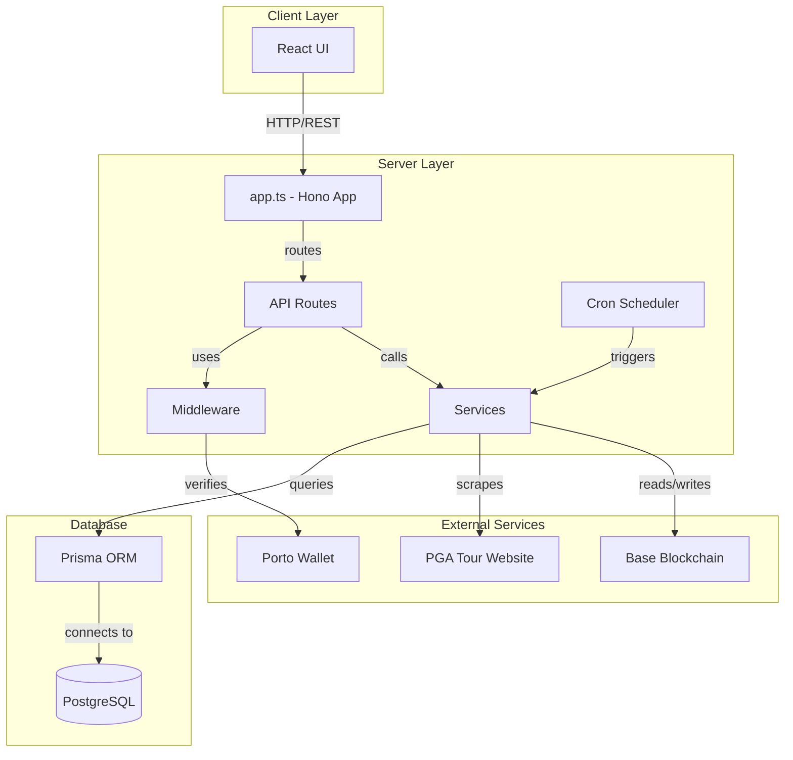
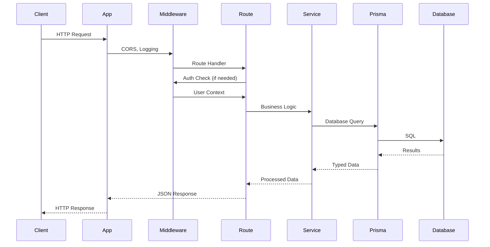

# Server Architecture

## High-Level Architecture



## Request Flow



## Component Relationships

### App → Routes → Services → Prisma
- **App** (`app.ts`): Main Hono application, middleware setup
- **Routes** (`routes/*.ts`): HTTP endpoint handlers
- **Services** (`services/*.ts`): Business logic, external integrations
- **Prisma**: Database access layer

### Cron → Services
- **Cron Scheduler**: Triggers services on schedule
- **Services**: Execute business logic (tournament updates, contest operations)

## Key Architectural Patterns

### Layered Architecture
- **Presentation Layer**: Routes handle HTTP
- **Business Layer**: Services contain logic
- **Data Layer**: Prisma handles database

### Middleware Pattern
- **CORS**: Cross-origin resource sharing
- **Logging**: Request/response logging
- **Authentication**: JWT verification
- **Error Handling**: Centralized error responses

### Service Pattern
- Services encapsulate business logic
- Reusable across routes and cron jobs
- Single responsibility per service
- Testable in isolation

### Repository Pattern (via Prisma)
- Prisma provides type-safe database access
- Abstracts SQL queries
- Handles migrations and schema management

## Data Flow Patterns

### Read Flow (Tournament Data)
```
Client Request → Route → Service → Prisma → Database
                                    ↓
                              Transform Data
                                    ↓
Client Response ← Route ← Service ← Prisma
```

### Write Flow (Create Contest)
```
Client Request → Route → Auth Middleware → Service → Prisma → Database
                                                          ↓
                                                    Create Record
                                                          ↓
Client Response ← Route ← Service ← Prisma ← Database
```

### Cron Flow (Update Tournament)
```
Cron Scheduler → Service → PGA Scraping → Transform → Prisma → Database
                                                              ↓
                                                        Update Records
```

## Key Design Decisions

### Why Hono Instead of Express?
- **Performance**: Faster, lighter weight
- **TypeScript**: Better TypeScript support
- **Modern**: Built for modern JavaScript
- **Compatibility**: Similar API to Express

### Why Prisma?
- **Type Safety**: Generated TypeScript types
- **Migrations**: Built-in migration system
- **Developer Experience**: Great tooling
- **Query Builder**: Type-safe queries

### Why Separate Services?
- **Reusability**: Used by routes and cron jobs
- **Testability**: Easy to test in isolation
- **Maintainability**: Clear separation of concerns
- **Scalability**: Can be moved to separate services later

### Why Cron Jobs?
- **Automation**: No manual intervention needed
- **Reliability**: Runs on schedule
- **Efficiency**: Batch operations
- **Consistency**: Regular updates

## Security Patterns

### Authentication
- SIWE (Sign-In With Ethereum) for wallet-based auth
- JWT tokens stored in HTTP-only cookies
- Porto integration for signature verification

### Authorization
- Middleware checks user permissions
- User group membership validation
- Contest ownership checks

### Error Handling
- Centralized error handler
- Consistent error responses
- Error logging for debugging
- No sensitive data in errors

## Scalability Considerations

### Current Architecture
- Single server instance
- Direct database connections
- Synchronous operations

### Future Considerations
- **Horizontal Scaling**: Stateless API allows multiple instances
- **Database**: Connection pooling via Prisma
- **Caching**: Can add Redis for frequently accessed data
- **Queue System**: Can move cron jobs to background workers
- **CDN**: Static files can be served from CDN

