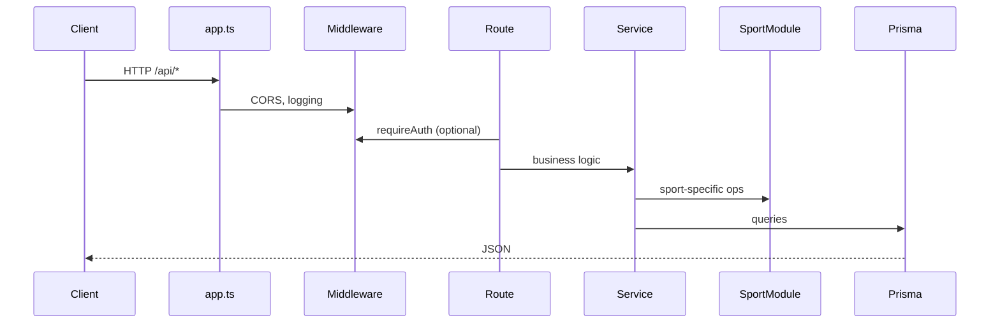
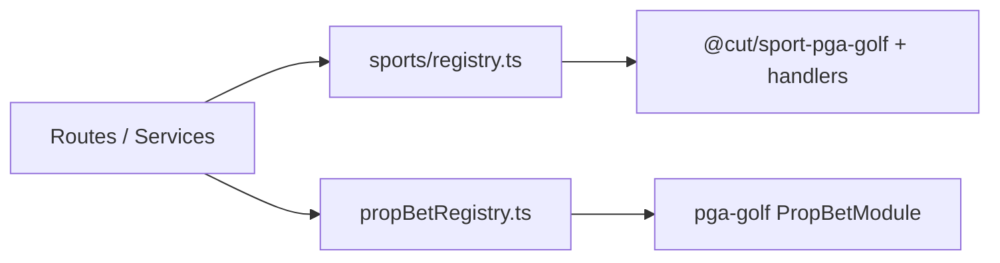

# Server architecture

## Request flow

```mermaid
sequenceDiagram
  participant Client
  participant Hono as app.ts
  participant MW as Middleware
  participant Route
  participant Svc as Service
  participant Plugin as SportModule
  participant DB as Prisma

  Client->>Hono: HTTP /api/*
  Hono->>MW: CORS, logging
  Route->>MW: requireAuth (optional)
  Route->>Svc: business logic
  Svc->>Plugin: sport-specific ops
  Svc->>DB: queries
  DB-->>Client: JSON
```

## Layering

| Layer | Responsibility |
|-------|----------------|
| **Routes** (`src/routes/*.ts`) | HTTP parsing, status codes, auth gates |
| **Services** (`src/services/**`) | Platform business rules, batch ops, orchestration |
| **Plugins** (`src/sports/registry.ts`, `propBetRegistry.ts`) | Sport-specific ingest, scoring, prop quotes |
| **Prisma** | Typed DB access |

Routes stay thin; reusable logic lives in services so cron and admin can share it.

## Registries

```mermaid
graph LR
  API[Routes / Services] --> SR[sports/registry.ts]
  API --> PR[propBetRegistry.ts]
  SR --> Golf["@cut/sport-pga-golf + handlers"]
  PR --> GolfProp[pga-golf PropBetModule]
```

- `requireSportModule(sportId)` — throws if sport not registered
- `getPropBetModule(sportId)` — returns `undefined` if sport has no props

## Middleware

| Middleware | File | Usage |
|------------|------|-------|
| `requireAuth` | `middleware/auth.ts` | Privy token → Cut user; provisions wallet |
| `requireAdmin` | `middleware/admin.ts` | Staff user types |
| `requireEventEditable` | `middleware/eventEditable.ts` | Blocks lineup writes after event starts |
| `requireUserGroupMember` | `middleware/userGroup.ts` | League access |
| `requireUserGroupAdmin` | `middleware/userGroup.ts` | League admin actions |

## Major subsystems

### Events & lineups

- Active event: `CompetitionEvent.isActive` (one per sport, set by init)
- Candidates: sport plugin `getCandidatePool`
- Lineup create/update: `services/lineups/createLineupForEvent.ts` / `updateLineupById.ts` → validates via plugin, marks side-bet stale

### Contests

- HTTP: `routes/contest.ts`
- Lifecycle batches: `services/batch/batchActivateContests.ts`, `batchSettleContests.ts`
- Settlement: `services/contest/settleContest.ts` → plugin ranking + on-chain operator `settleContest(..., secondaryWinner)`

### Side bets

- HTTP: `routes/bets.ts`
- Ingest: `services/propBets/` + `PropBetModule`
- Admin: `routes/admin.ts` lock/settle/close batches

### SPA HTML / Open Graph

`app.ts` serves `index.html` for non-API routes and rewrites title + OG/Twitter tags per path (`lib/pageMetadata.ts`).

| Path | Title |
|------|-------|
| `/contest/:id` | `$entry Contest Name \| Play The Cut` (contest description when present) |
| `/sports/:sportId/events/:eventId/leaderboard?playerId=` | `Player Name \| Event Name` (`playerId` is `Participant.id`) |
| `/sports/:sportId/leaderboard?playerId=` | Same, resolved against the sport's active event |
| `/sports/:sportId/events/:eventId/leaderboard` | `Event Name \| Play The Cut` |
| `/sports/:sportId/leaderboard` | Same, resolved against the sport's active event |
| All other HTML routes | `Play The Cut` |

HTML is never cached so crawlers and share unfurls pick up the rewrite on the next request.

### Email

- `lib/email/` — templates keyed by `eventId` in `EmailSendLog`
- Blasts: `scripts/sendBlastEmail.ts`

### Legacy

- `routes/legacy.ts` — 501 for `/tournaments` and `/lineup`
- Old route files (`tournament.ts`, `lineup.ts`) excluded from build; not mounted

## Security

- Privy Bearer tokens on protected routes
- League contests hidden from non-members (404)
- Admin routes require staff `userType`
- Side bets gated by `SIDE_BETS_ENABLED`

## Scalability notes

- API is stateless; cron uses in-process locks (`scorePipelineRunning`, `overviewPipelineRunning`) to prevent overlap
- `scorePipeline` every 5 min, `overviewPipeline` every 20 min, plus in-process commentary `feedWorker`
