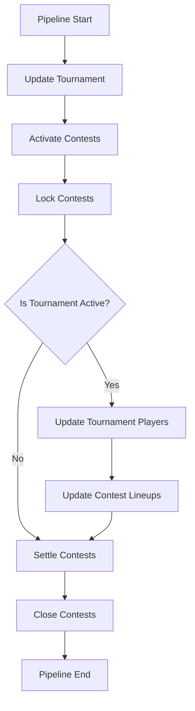

# Server Cron Jobs

## Overview

Cron jobs automate regular tasks like tournament updates, contest state transitions, and score calculations. The cron scheduler runs a pipeline every 5 minutes.

## Cron Scheduler

### Location
`server/src/cron/scheduler.ts`

### Configuration
- **Schedule**: Every 5 minutes (`*/5 * * * *`)
- **Enabled**: Controlled by environment variable
- **Pipeline**: Sequential execution of jobs

## Pipeline Execution Order

## Pipeline Jobs

### 1. Update Tournament
- **Service**: `updateTournament.ts`
- **Purpose**: Fetch latest tournament data from PGA Tour
- **Frequency**: Every 5 minutes
- **Operations**:
  - Scrape tournament page
  - Update tournament status, rounds, leaderboard
  - Update tournament metadata

### 2. Activate Contests
- **Service**: `batchActivateContests.ts`
- **Purpose**: Activate contests that should be active
- **Frequency**: Every 5 minutes
- **Criteria**: Contest is OPEN and tournament has started
- **Operations**:
  - Find contests to activate
  - Call contract `activateContest()` for each
  - Update database status

### 3. Lock Contests
- **Service**: `batchLockContests.ts`
- **Purpose**: Lock contests that should be locked
- **Frequency**: Every 5 minutes
- **Criteria**: Contest is ACTIVE and should be locked (based on tournament state)
- **Operations**:
  - Find contests to lock
  - Call contract `lockContest()` for each
  - Update database status

### 4. Update Tournament Players (Conditional)
- **Service**: `updateTournamentPlayers.ts`
- **Purpose**: Update player scores and leaderboard
- **Frequency**: Every 5 minutes (only if tournament is active)
- **Condition**: Tournament status is "IN_PROGRESS" and round is in progress or complete
- **Operations**:
  - Scrape player scorecards
  - Calculate Stableford scores
  - Update TournamentPlayer records
  - Update leaderboard positions

### 5. Update Contest Lineups (Conditional)
- **Service**: `updateContestLineups.ts`
- **Purpose**: Update contest lineup scores and create timeline snapshots
- **Frequency**: Every 5 minutes (only if tournament is active)
- **Condition**: Runs after player updates
- **Operations**:
  - Calculate lineup scores from player scores
  - Update ContestLineup records
  - Create ContestLineupTimeline snapshots
  - Update contest leaderboard positions

### 6. Settle Contests
- **Service**: `batchSettleContests.ts`
- **Purpose**: Settle contests that should be settled
- **Frequency**: Every 5 minutes
- **Criteria**: Contest is ACTIVE or LOCKED and tournament has ended
- **Operations**:
  - Find contests to settle
  - Calculate winners and payouts
  - Call contract `settleContest()` for each
  - Update database status and results

### 7. Close Contests
- **Service**: `batchCloseContests.ts`
- **Purpose**: Close contests after expiry
- **Frequency**: Every 5 minutes
- **Criteria**: Contest is SETTLED and past expiry timestamp
- **Operations**:
  - Find contests to close
  - Call contract `closeContest()` for each
  - Update database status

## Error Handling

### Connection Errors
- If database connection error (P2037), wait 30 seconds before continuing
- Prevents pipeline from failing on transient connection issues

### Individual Job Errors
- Each job's errors are caught and logged
- Pipeline continues to next job
- Errors don't stop entire pipeline

### Pipeline Lock
- `pipelineRunning` flag prevents overlapping executions
- If pipeline is already running, skip execution
- Prevents race conditions and duplicate work

## Logging

### Job Start/Completion
- Each job logs start and completion
- Batch operations log success/failure counts
- Pipeline logs total duration

### Error Logging
- Errors are logged with context
- Includes job name and error details
- Helps with debugging

## Manual Triggering

### API Endpoint
- `POST /api/cron/trigger` (admin only)
- Manually trigger pipeline execution
- Useful for testing and debugging

## Configuration

### Environment Variables
- Cron can be disabled via configuration
- Useful for development/testing
- Production: Always enabled

### Schedule Customization
- Currently hardcoded to 5 minutes
- Can be adjusted in `scheduler.ts`
- Consider different schedules for different jobs

## Performance Considerations

### Sequential Execution
- Jobs run sequentially (not parallel)
- Prevents database contention
- Ensures data consistency

### Conditional Execution
- Player/lineup updates only run when tournament is active
- Reduces unnecessary work
- Improves performance

### Batch Operations
- Contest operations are batched
- Reduces contract call overhead
- More efficient than individual calls

## Future Improvements

### Parallel Execution
- Some jobs could run in parallel
- Tournament update and contest operations are independent
- Would reduce total pipeline time

### Separate Schedules
- Different jobs could have different schedules
- Player updates: Every 10 minutes
- Contest operations: Every 5 minutes
- More granular control

### Queue System
- Move to background job queue (Bull, BullMQ)
- Better error handling and retries
- Job prioritization
- Monitoring and observability

