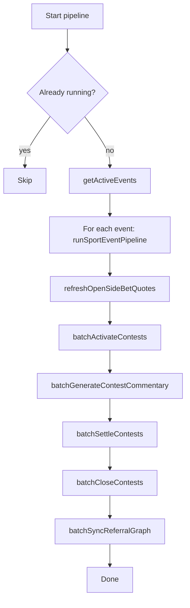

# Cron jobs

**Scheduler:** `server/src/cron/scheduler.ts`  
**Enabled when:** `ENABLE_CRON=true` (main server or `cron-app.ts`)

Schedule: **`*/5 * * * *`** (every 5 minutes) — single job `mainPipeline`.

---

## Pipeline sequence


```mermaid
flowchart TD
  A[Start pipeline] --> B{Already running?}
  B -->|yes| Z[Skip]
  B -->|no| C[getActiveEvents]
  C --> D[For each event: runSportEventPipeline]
  D --> E[refreshOpenSideBetQuotes]
  E --> F[batchActivateContests]
  F --> G[batchGenerateContestCommentary]
  G --> H[batchSettleContests]
  H --> I[batchCloseContests]
  I --> J[batchSyncReferralGraph]
  J --> K[Done]
```

### 1. Sport event pipeline

For each `CompetitionEvent` with `isActive=true`:

`runSportEventPipeline(eventId, sportId)`:

1. `syncEventMetadata`
2. `syncParticipantField`
3. `handleWithdrawals` (if plugin implements)
4. If live (`shouldSyncLiveScores` on metadata — golf: `golfShouldSyncLiveScores`; commodities: `commoditiesShouldSyncLiveScores`):
   - `syncLiveScores`
   - `updateContestLineupsForEvent` — aggregates lineup scores (raw pick totals + optional popularity adjustment after contest lock; see [consensus-axis.md](../../docs/platform/consensus-axis.md)), ranks entries, writes timeline snapshots

**Commodities:** metadata and field sync every pass; live scores only when `sessionStarted && !sessionComplete`. No golf-style leaderboard/scorecard fetch — prices come from Hyperliquid candles/marks. Manual sync: `service:sync-commodities-metadata`, `-field`, `-scores`.

### 2. Side-bet quote refresh

`refreshOpenSideBetQuotes`:

- Skips if `SIDE_BETS_ENABLED` is not true or no `DATAGOLF_API_KEY`
- Finds 4-pick lineups on active events with ingestible market status
- Fetches one DataGolf snapshot per batch
- Calls `ingestPropBetQuoteForLineup` per lineup

**Not in cron:** side-bet lock, settle, close — those are **admin** operations.

### 3. Contest batches

| Batch                            | Typical transition                                                       |
| -------------------------------- | ------------------------------------------------------------------------ |
| `batchActivateContests`          | `OPEN` → `ACTIVE` when sport says event is live                          |
| `batchGenerateContestCommentary` | Refresh latest live PGA analysis when missing or at least 20 minutes old |
| `batchSettleContests`            | → `SETTLED` when event complete + oracle flow                            |
| `batchCloseContests`             | → `CLOSED` after settlement window                                       |

Uses `SportModule.shouldActivateContest` / `shouldSettleContest` via event status.

Commentary generation requires `CONTEST_COMMENTARY_ENABLED=true` and
`CURSOR_API_KEY`. It runs only for entered `ACTIVE` or `LOCKED` PGA contests
whose event is active and reports `LIVE`. Each successful update replaces the
latest `Contest.commentary` snapshot; failures preserve the previous update.

### 4. Referral graph

`batchSyncReferralGraph` — syncs on-chain referral registrations.

---

## Concurrency

- `pipelineRunning` flag prevents overlapping pipeline runs
- On DB connection errors (`P2037`), waits 30s before next attempt

---

## Manual / CLI operations

| Task                       | Command / API                                               |
| -------------------------- | ----------------------------------------------------------- |
| Init golf event            | `pnpm run service:init-event pga-golf R2026033`             |
| Init commodities event     | `pnpm run service:init-event commodities 2026-W27`          |
| Sync commodities (manual)  | `service:sync-commodities-metadata` · `-field` · `-scores`  |
| Lock contests              | `POST /api/admin/contests/lock-eligible`                    |
| Side-bet lock/settle/close | `POST /api/admin/bets/side/*`                               |
| Email blast                | `pnpm --filter server run script:send-blast new-tournament` |

See [docs/sports/golf/event-activation-runbook.md](../../docs/sports/golf/event-activation-runbook.md).

---

## Status endpoint

`GET /api/cron/status` returns:

```json
{
  "enabled": true,
  "status": "active",
  "activeJobs": ["mainPipeline"],
  "pipelineSteps": ["mainPipeline (*/5 * * * *)", "..."]
}
```
