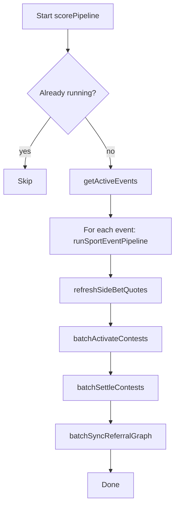

# Cron jobs

**Scheduler:** `server/src/cron/scheduler.ts`  
**Enabled when:** `ENABLE_CRON=true` (main server or `cron-app.ts`)

Schedules:

| Job | Cron | Purpose |
| --- | --- | --- |
| `scorePipeline` | `*/5 * * * *` | Scores, side-bet quotes, contest lifecycle, referral sync |
| `overviewPipeline` | `*/20 * * * *` | Legacy PGA `Contest.commentary` overview refresh |
| `feedWorker` | in-process loop | Drain `CommentaryFeedJob` queue (concurrency 1) |

---

## Score pipeline sequence


```mermaid
flowchart TD
  A[Start scorePipeline] --> B{Already running?}
  B -->|yes| Z[Skip]
  B -->|no| C[getActiveEvents]
  C --> D[For each event: runSportEventPipeline]
  D --> E[refreshSideBetQuotes]
  E --> F[batchActivateContests]
  F --> G[batchSettleContests]
  G --> H[batchSyncReferralGraph]
  H --> K[Done]
```

### 1. Sport event pipeline

For each `CompetitionEvent` with `isActive=true`:

`runSportEventPipeline(eventId, sportId)`:

1. `syncEventMetadata`
2. `syncParticipantField`
3. `handleWithdrawals` (if plugin implements)
4. If live (`shouldSyncLiveScores` on metadata — golf: `golfShouldSyncLiveScores`; commodities: `commoditiesShouldSyncLiveScores`):
   - `syncLiveScores` (skips `EventParticipant` rows whose total / score fingerprint is unchanged)
   - `updateContestLineupsForEvent` — aggregates lineup scores (raw pick totals + optional popularity adjustment after contest lock; see [consensus-axis.md](../../docs/platform/consensus-axis.md)), ranks entries, writes timeline snapshots **only for lineups that changed**
   - `afterLiveScoreSync` (optional) — golf: classify contest feed stories and enqueue `CommentaryFeedJob` rows (no Cursor)

**PGA field sync cadences** (`server/src/sports/pga-golf/syncField.ts`):

| Work | Cadence |
| ---- | ------- |
| Field membership + names (`Participant` / `EventParticipant`) | Every 5m, but **skips unchanged rows**; merges `metadata` (does not wipe enrich fields) |
| Profile enrich (`lastFieldEnrichAt`) | About every **30 minutes**, or when the field changes |
| Tee times (`lastTeeTimeSyncAt`) | About every **30 minutes**, or when the field changes |
| Live scores + lineup scores/positions | Every 5m while live (no-op skips when unchanged) |
| Feed classify + enqueue | Every live score pass (golf `afterLiveScoreSync`) |

Multi-minute hung `UPDATE`s on primary keys are a bug symptom (client timeout / lock pile-up), not expected load for this traffic size.

**Commodities:** metadata and field sync every pass; live scores only when `sessionStarted && !sessionComplete`. No golf-style leaderboard/scorecard fetch — prices come from Hyperliquid candles/marks. Manual sync: `service:sync-commodities-metadata`, `-field`, `-scores`. Daily contest overview commentary runs on the overview pipeline (day-settle), not inside this score pass.

### Prisma connection params (cron host)

`server/src/lib/prisma.ts` appends pool params to `DATABASE_URL`. Override via env (see `swarm/env/cron.env.example`):

| Env | Default |
| --- | ------- |
| `PRISMA_CONNECTION_LIMIT` | `5` |
| `PRISMA_POOL_TIMEOUT` | `20` |
| `PRISMA_CONNECT_TIMEOUT` | `10` |
| `PRISMA_SOCKET_TIMEOUT` | `60` |

Pi cron should keep `PRISMA_SOCKET_TIMEOUT` at least `60` (home → managed Postgres RTT). Prefer the direct DB URL; pgBouncer does not fix lock storms from parallel per-row updates.

### 2. Side-bet quote refresh

Golf-owned entry: `server/src/sports/pga-golf/cron/refreshSideBetQuotes.ts` → `refreshOpenSideBetQuotes`:

- Skips if `SIDE_BETS_ENABLED` is not true or no `DATAGOLF_API_KEY`
- Finds 4-pick lineups on active events with ingestible market status
- Fetches one DataGolf snapshot per batch
- Calls `ingestPropBetQuoteForLineup` per lineup

**Not in cron:** side-bet lock, settle, close — those are **admin** operations.

### 3. Contest batches

| Batch                   | Typical transition                              |
| ----------------------- | ----------------------------------------------- |
| `batchActivateContests` | `OPEN` → `ACTIVE` when sport says event is live |
| `batchSettleContests`   | → `SETTLED` when event complete + operator settle |

Terminal on-chain states are `SETTLED` / `CANCELLED`. Permissionless `cancelExpired` applies after expiry + grace if unsettled.

Uses `SportModule.shouldActivateContest` / `shouldSettleContest` via event status.

### 4. Referral graph

`batchSyncReferralGraph` — syncs on-chain referral registrations.

---

## Overview pipeline (`*/20`)

Runs two sport-specific overview refreshers under the shared commentary LLM mutex (skips a pass if the lock is held). Requires `CONTEST_COMMENTARY_ENABLED=true` and `CURSOR_API_KEY`.

| Refresher | Sport | Behavior |
| --- | --- | --- |
| `refreshContestOverviews` | PGA Golf | Refresh `Contest.commentary` for entered `ACTIVE`/`LOCKED` contests on LIVE events when missing or ≥ 20 minutes old |
| `refreshCommoditiesContestOverviews` | Commodities | Refresh `Contest.commentary` when a trading day has newly settled (idempotent vs that day’s session close) for `ACTIVE`/`LOCKED`/`SETTLED` contests on the active event |

Neither refresher generates feed items.

---

## Commentary feed worker

In-process loop started with the scheduler when commentary is enabled:

1. Claim next `CommentaryFeedJob` (`pending` → `running`, `FOR UPDATE SKIP LOCKED`)
2. Generate story copy from frozen candidates + fact packs (Cursor)
3. Merge into `Contest.commentaryFeed`, publish Stream items, mark `done`
4. Concurrency **1**; reclaim `running` jobs older than `COMMENTARY_FEED_JOB_STALE_MS` (default 15m)
5. Refuse enqueue when pending count ≥ `COMMENTARY_FEED_MAX_PENDING` (default 20)

Detect path (`detectAndEnqueueContestFeed`) advances `lastHoleState` / `lastContext` at classify time so the next score tick does not re-fire the same swing while a job is pending.

---

## Concurrency

- `scorePipelineRunning` / `overviewPipelineRunning` prevent overlapping runs of each pipeline
- Commentary LLM mutex prevents concurrent Cursor calls (overview vs feed worker)
- On DB connection errors (`P2037`), waits 30s before the wrapper returns

---

## Manual / CLI operations

| Task                       | Command / API                                               |
| -------------------------- | ----------------------------------------------------------- |
| Init golf event            | `pnpm run service:init-event pga-golf R2026033`             |
| Init commodities event     | `pnpm run service:init-event commodities 2026-W27`          |
| Sync commodities (manual)  | `service:sync-commodities-metadata` · `-field` · `-scores`  |
| Lock contests              | `POST /api/admin/contests/lock-eligible`                    |
| Side-bet lock/settle/close | `POST /api/admin/bets/side/*`                               |
| Email blast                | `pnpm --filter server run script:send-blast new-tournament` |

See [docs/sports/golf/event-activation-runbook.md](../../docs/sports/golf/event-activation-runbook.md).

---

## Status endpoint

`GET /api/cron/status` returns:

```json
{
  "enabled": true,
  "status": "active",
  "activeJobs": ["scorePipeline", "overviewPipeline"],
  "pipelineSteps": ["scorePipeline (*/5 * * * *)", "..."]
}
```
