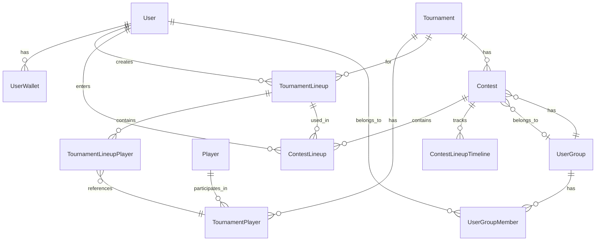

# Server Data Models

## Database Schema Overview

The database uses PostgreSQL with Prisma ORM. The schema is defined in `server/prisma/schema.prisma`.

## Core Models

### User
- **Purpose**: User accounts
- **Key Fields**:
  - `id`: Unique identifier (CUID)
  - `email`: Email address (optional, unique)
  - `phone`: Phone number (optional, unique)
  - `name`: Display name
  - `userType`: User type (default: "USER")
  - `settings`: JSON settings object
  - `isVerified`: Verification status
- **Relations**:
  - `wallets`: UserWallet[]
  - `tournamentLineups`: TournamentLineup[]
  - `contestLineups`: ContestLineup[]
  - `userGroups`: UserGroupMember[]

### UserWallet
- **Purpose**: Blockchain wallet addresses linked to users
- **Key Fields**:
  - `id`: Unique identifier
  - `userId`: Foreign key to User
  - `chainId`: Blockchain chain ID (8453 = Base, 84532 = Base Sepolia)
  - `publicKey`: Wallet address
  - `isPrimary`: Primary wallet flag
- **Relations**:
  - `user`: User

### UserGroup
- **Purpose**: Groups of users (for private contests)
- **Key Fields**:
  - `id`: Unique identifier
  - `name`: Group name
  - `description`: Optional description
- **Relations**:
  - `members`: UserGroupMember[]
  - `contests`: Contest[]

### UserGroupMember
- **Purpose**: Junction table for user-group membership
- **Key Fields**:
  - `id`: Unique identifier
  - `userId`: Foreign key to User
  - `userGroupId`: Foreign key to UserGroup
  - `role`: Member role (default: "MEMBER")
- **Relations**:
  - `user`: User
  - `userGroup`: UserGroup

## Tournament Models

### Tournament
- **Purpose**: PGA Tour tournament data
- **Key Fields**:
  - `id`: Unique identifier
  - `pgaTourId`: PGA Tour tournament ID
  - `name`: Tournament name
  - `startDate`: Tournament start date
  - `endDate`: Tournament end date
  - `status`: Tournament status
  - `manualActive`: Flag for active tournament
  - `roundStatusDisplay`: Current round status
  - `currentRound`: Current round number
- **Relations**:
  - `tournamentPlayers`: TournamentPlayer[]
  - `tournamentLineups`: TournamentLineup[]
  - `contests`: Contest[]

### Player
- **Purpose**: Golf player data from PGA Tour
- **Key Fields**:
  - `id`: Unique identifier
  - `pga_pgaTourId`: PGA Tour player ID (unique)
  - `pga_displayName`: Display name
  - `pga_imageUrl`: Player image URL
  - `isActive`: Active player flag
  - `inField`: In current tournament field
- **Relations**:
  - `tournamentPlayers`: TournamentPlayer[]

### TournamentPlayer
- **Purpose**: Player participation in a tournament
- **Key Fields**:
  - `id`: Unique identifier
  - `tournamentId`: Foreign key to Tournament
  - `playerId`: Foreign key to Player
  - `leaderboardPosition`: Current position
  - `r1`, `r2`, `r3`, `r4`: Round scores (JSON)
  - `cut`: Cut score
  - `bonus`: Bonus points
  - `total`: Total score
- **Relations**:
  - `player`: Player
  - `tournament`: Tournament
  - `tournamentLineups`: TournamentLineupPlayer[]

## Lineup Models

### TournamentLineup
- **Purpose**: User's lineup for a tournament
- **Key Fields**:
  - `id`: Unique identifier
  - `userId`: Foreign key to User
  - `tournamentId`: Foreign key to Tournament
  - `name`: Lineup name
- **Relations**:
  - `user`: User
  - `tournament`: Tournament
  - `players`: TournamentLineupPlayer[]
  - `contestLineups`: ContestLineup[]

### TournamentLineupPlayer
- **Purpose**: Junction table for lineup players
- **Key Fields**:
  - `id`: Unique identifier
  - `tournamentLineupId`: Foreign key to TournamentLineup
  - `tournamentPlayerId`: Foreign key to TournamentPlayer
- **Relations**:
  - `tournamentLineup`: TournamentLineup
  - `tournamentPlayer`: TournamentPlayer

## Contest Models

### Contest
- **Purpose**: Contest instance (linked to blockchain contract)
- **Key Fields**:
  - `id`: Unique identifier
  - `name`: Contest name
  - `address`: Blockchain contract address
  - `chainId`: Blockchain chain ID
  - `tournamentId`: Foreign key to Tournament
  - `userGroupId`: Optional foreign key to UserGroup
  - `status`: Contest status (OPEN, ACTIVE, LOCKED, SETTLED, CLOSED, CANCELLED)
  - `endTime`: Contest end time
  - `settings`: JSON settings
  - `results`: JSON results
- **Relations**:
  - `tournament`: Tournament
  - `userGroup`: UserGroup? (optional)
  - `contestLineups`: ContestLineup[]
  - `timelines`: ContestLineupTimeline[]

### ContestLineup
- **Purpose**: User's lineup entered in a contest
- **Key Fields**:
  - `id`: Unique identifier
  - `contestId`: Foreign key to Contest
  - `tournamentLineupId`: Foreign key to TournamentLineup
  - `userId`: Foreign key to User
  - `entryId`: Blockchain entry ID (uint256 as string)
  - `status`: Lineup status
  - `score`: Calculated score
  - `position`: Leaderboard position
- **Relations**:
  - `contest`: Contest
  - `tournamentLineup`: TournamentLineup
  - `user`: User
  - `timelines`: ContestLineupTimeline[]

### ContestLineupTimeline
- **Purpose**: Historical snapshots of contest lineup scores
- **Key Fields**:
  - `id`: Unique identifier
  - `contestLineupId`: Foreign key to ContestLineup
  - `contestId`: Foreign key to Contest
  - `timestamp`: Snapshot timestamp
  - `roundNumber`: Round number
  - `score`: Score at this timestamp
  - `position`: Position at this timestamp
- **Relations**:
  - `contestLineup`: ContestLineup
  - `contest`: Contest

## Data Relationships

## Key Design Decisions

### Why Separate TournamentLineup and ContestLineup?
- **TournamentLineup**: User's lineup for a tournament (reusable)
- **ContestLineup**: Entry in a specific contest (links to blockchain)
- Allows users to reuse lineups across multiple contests

### Why ContestLineupTimeline?
- Historical tracking of scores over time
- Enables timeline visualizations
- Snapshot-based for performance

### Why JSON Fields?
- **settings**: Flexible contest configuration
- **results`: Flexible result storage
- **r1-r4**: Round scores stored as JSON (flexible structure)
- **venue`, `weather`, `performance`: Flexible PGA Tour data

### Indexing Strategy
- Indexes on foreign keys for join performance
- Indexes on frequently queried fields (status, chainId, etc.)
- Composite indexes for common query patterns

