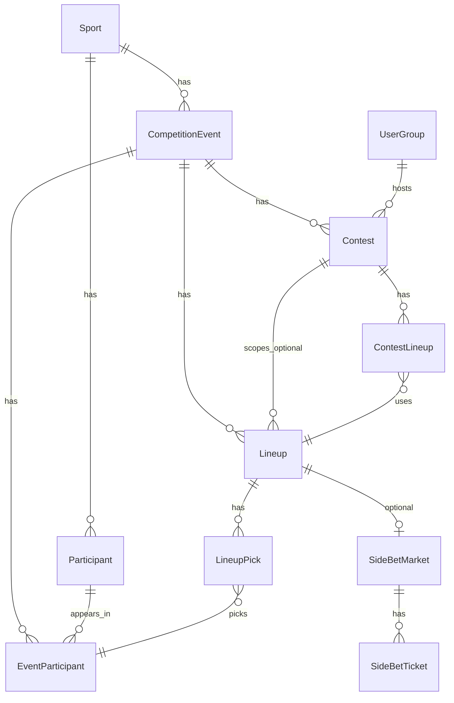

# Server data models (v4 platform)

Schema: `server/prisma/schema.prisma`  
Baseline migration: `20260611153145_init_platform_schema`

Legacy models **`Tournament`**, **`Player`**, **`TournamentPlayer`**, **`TournamentLineup`** were removed on v4.

---

## Identity & social

### User
- Privy-linked (`privyUserId`), profile, `settings` JSON
- Referral fields: `referrerAddress`, `referralGroupId`, `referredByUserId`, etc.
- Relations: `lineups`, `contestLineups`, `wallets`, `userGroups`, `sideBetTickets`

### UserWallet
- `chainId` + `publicKey` (unique per chain)
- `isPrimary` for default wallet

### UserGroup (league)
- **No sport field** — cross-sport by design
- Optional `inviteCode` for self-join

### UserGroupMember
- `role`: `ADMIN` | `MEMBER`

---

## Sport registry

### Sport
| Field | Example |
|-------|---------|
| `id` | `pga-golf` |
| `slug` | URL segment |
| `rosterRules` | `{ slotCount: 4, minPicks: 0, maxPicks: 4, allowDuplicates: false }` |
| `scoringRules` | `{ aggregation: "sum", direction: "higher_wins" }` |

### CompetitionEvent
| Field | Purpose |
|-------|---------|
| `sportId` | FK → Sport |
| `externalId` | Sport-native id (golf: `R2026033`) |
| `isActive` | Only one active per sport (set by init) |
| `metadata` | Sport-specific JSON (name, dates, course, summary, round status, …) |

### Participant
- Global competitor per sport (`externalId`, `displayName`, `metadata`)

### EventParticipant
- Competitor in one event
- `scoreData` JSON (golf: `leaderboardPosition`, hole scores, …)
- `total` — external pick score `e_i` (event-scoped; base for popularity adjustment)

---

## Lineups

### Lineup
- `userId` + `eventId` — **many lineups per user per event**
- `contestId` optional FK — contest lobby always sets it; scopes drafts and duplicate checks per contest
- `prediction` JSON (`{ type: "winningLineupTotal", value: number }`)
- `predictionRules` JSON on `Sport` (`min`, `max`, `defaultRandomMin`, `defaultRandomMax`)
- `name` optional display label

### LineupPick
- `lineupId` + `eventParticipantId`
- `slotIndex` optional ordering

```
Lineup ──< LineupPick >── EventParticipant
```

---

## Contests

### Contest
| Field | Notes |
|-------|-------|
| `eventId` | Determines sport via event |
| `userGroupId` | Optional league scope |
| `address` | On-chain `ContestController` |
| `chainId` | 8453 / 84532 |
| `status` | `OPEN` \| `ACTIVE` \| `LOCKED` \| `SETTLED` \| `CLOSED` |
| `settings` | Primary deposit, oracle, expiry, subsidy bps, … |
| `results` | Settlement snapshot JSON |
| `pickPopularity` | `Json?` — per-player popularity after lock (`pickRate`, `bonus`, `adjustedScore` keyed by `eventParticipantId`) |
| `pickPopularityLockedAt` | `DateTime?` — when pick rates were snapshotted |

See [consensus-axis.md](../../docs/platform/consensus-axis.md) for shape and cron write path.

### ContestLineup
- Links `contestId` + `lineupId` + `userId`
- `entryId` — on-chain entry (uint256)
- `score` — final ranked total (`finalScore`)
- `baseScore`, `popularityBonus` — lineup aggregates (sum of picks' `pickPopularity` values)
- `position` — updated during live play / settlement

### ContestLineupTimeline
- Time series of `score` (final total) and `position` per entry for charts

### ContestSecondaryParticipant
- Secondary market buyers indexed from chain events

### OnchainPayment
- Indexed payout rows (`PRIMARY`, `SECONDARY`, `REFERRAL`)

---

## Side bets

### SideBetMarket
- One per `lineupId` (unique)
- `eventId`, `status`, `quoteVersion`
- DataGolf metadata: `dgEventId`, `dgEventName`, timestamps

**Status:** `UNAVAILABLE` → `OPEN` → `LOCKED` → `SETTLED` / `VOID` / `CLOSED`

### SideBetSelection
- Priced cell: `hitsRequired`, `topN`, `decimalOdds`, `americanDisplay`, `quoteVersion`

### SideBetTicket
- User stake on a market
- `eventParticipantIds` — four IDs frozen at placement
- `status`: `OPEN` \| `WON` \| `LOST` \| `VOID` \| `REFUND_PENDING`

---

## Email

### EmailSendLog
- `dedupeKey` unique — idempotency
- `eventId` optional FK (was `tournamentId` in legacy)
- `kind`: `WELCOME`, `NEW_TOURNAMENT`, `REMINDER_NO_CONTEST`, etc.

---

## Entity relationship (simplified)


```mermaid
erDiagram
  Sport ||--o{ CompetitionEvent : has
  Sport ||--o{ Participant : has
  CompetitionEvent ||--o{ EventParticipant : has
  Participant ||--o{ EventParticipant : appears_in
  CompetitionEvent ||--o{ Lineup : has
  Contest ||--o{ Lineup : scopes_optional
  Lineup ||--o{ LineupPick : has
  LineupPick }o--|| EventParticipant : picks
  CompetitionEvent ||--o{ Contest : has
  UserGroup ||--o{ Contest : hosts
  Contest ||--o{ ContestLineup : has
  ContestLineup }o--|| Lineup : uses
  Lineup ||--o| SideBetMarket : optional
  SideBetMarket ||--o{ SideBetTicket : has
```

---

## Golf metadata conventions

Stored on `CompetitionEvent.metadata` and `Participant.metadata`:

| Key | Usage |
|-----|-------|
| `name`, `startDate`, `endDate` | Display, email, expiry |
| `course`, `city`, `state` | Event header |
| `status`, `roundDisplay`, `currentRound` | Live state |
| `summarySections` | Tournament preview JSON |
| `pgaTourId` | External id alias |
| Participant `pga_firstName` / rankings | Candidate display |

Tournament summary files: `server/src/tournamentSummaries/{externalId}.json`
